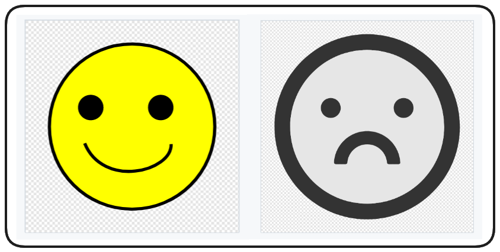

# NFTs

In this section of the course we'll be investigate Non-fungible Tokens (NFTs), we'll learn what an NFT is, why they're so cool and how to create our very own NFTs, one basic and one advanced.

## Two Flavors

As mentioned, we'll be learning two approaches to simple NFT development in this course. This first will be a basic implementation using these cute puppies!


In this first basic implementation our images are going to be stored in **[IPFS](https://ipfs.tech/)**.

With our second NFT, the art is going to be stored _on-chain_ and dynamic, changing based on a criteria we set, setting our mood from happy to sad or vice versa!



And, perhaps most excitingly, by the end of this section you'll have you're very own NFTs imported into your own wallet/metamask. You can also view them on service like OpenSea which will allow you to sell, trade, view and collect all sorts of NFTs!

## What is a NFT?

Non-fungible Tokens (NFTs) are a product of the **[ERC721 Token Standard](https://eips.ethereum.org/EIPS/eip-721)**, created on Ethereum.

NFTs are:

* Non-fungible: This means they are explicitly unique from one another and one NFT cannot be interchanged with another

Fungible tokens, like ERC20s are similar to a dollar. Any single dollar can be swapped with any other and no value is lost. NFTs by contrast are unique in themselves with different properties from token to token.

> ❗ **PROTIP**
> Think of NFTs like Pokemon! No two Pikachus are exactly the same and there are many different types within the same class or collection. Other comparisons include: trading cards, unique pieces of art

### What's an NFT do?

Because of their unique nature, NFTs have been widely adopted as a medium for art and a means to trade and collect digital art. Sometimes this gets a bad rap, but NFTs are only a standard on which a tonne of use case functionality can be built. Some protocol turn them into representations of game assets, or into tradeble metaverse items, sometimes they're used as means to keep record, or grant access to services or events.

The use cases of NFTs grow each day, but the easiest way to think of them currently is as unique digital assets, or unique digital art.

At their core, NFTs are tokens which exist on a smart contract platform, they can be viewed, bought and sold on marketplaces such as **[OpenSea](https://opensea.io/)** and **[Rarible](https://rarible.com/)**. The marketplaces aren't required of course, but the UI/UX is generally better than a command line.

Initial reactions to NFTs are often _**"What's the point of digital pictures?"**_, but it goes beyond that. Art has value and classically it's difficult for artists to be adequately compensated, or to assure proper attribution when their work is shared. In a world where copy and paste erodes digital ownership, NFTs claw back that value and afford artists greater control of and compensation from the work they do.

### ERC721 Standard (NFTs)

NFTs, and the ERC721 Token Standard, differ from ERC20s in a few fundamental ways.

**Ownership**

ERC20s handle ownership via a simple mapping of a uint256 token balance to an address.

ERC721s, by contrast, each have a unique tokenId, these tokenIds are mapped to a user's address. In addition to a tokenId, ERC721s include a tokenUri, we'll go into more detail later, but essentially a tokenUri details the unique properties of that token, stats, images etc.

**Fungibility**

NFTs are _non-fungible_. This means each token is unique and cannot be interchanged with another. ERC20s, on the other hand, are _fungible_. Any LINK token is identical in property and value to any other LINK token.

_**What makes an NFT unique?**_

The uniqueness of an NFT token is demonstrated by it's unique tokenId as well as it's metadata/tokenUri. This is a property of an NFT which details the attributes of that token. You can imagine a character in a game, the tokenUri would be their stats page and all the details that make them an individual.

Now, when we talk about NFT representing _Art_ that comes with some implications in the blockchain space that can be pretty impactful. In Ethereum, there's a little thing called **gas**. Gas costs on ethereum make the storage of large amounts of data (like images), on-chain, prohibitively expensive in most cases.

The solution to this was the inclusion of the tokenUri within the ERC721 Standard. This serves as a property of a token which details what the asset looks like as well as any attributes associated with it. A basic tokenUri looks something like:

```js
{
    "name": "Name",
    "description": "Description",
    "image": "ImageURI",
    "attributes": []
}
```

Even this can serve to be pretty expensive, so there's a constant discuss about on-chain vs off-chain metadata. Off-chain solutions obviously come with all the pitfalls of centralization that we would expect (including losing record of what your NFT is), but the easy and savings associated with avoiding deploying this extra data are pretty appealing.

Often a protocol will use a service like **[IPFS](https://ipfs.tech/)** to hedge their bets a little bit in a more decentralized method of storage, but it too comes with its own pros and cons.

To take this consideration even further, oftentimes marketplaces won't have a means to recognize on-chain metadata since they're _so_ used to looking for a tokenUri.

In General:

* Upload NFT Image to IPFS
* Create metadata point to that image
* Set the NFTs tokenUri to point to that metadata

## Foundry Setup

Now that we know what an NFT is, let's investigate how we can build our own.

To start, let's initialize our workspace. Create a new directory in your course folder.

```bash
mkdir foundry-nft
```

We can then switch to this directory and open it in VSCode.

```bash
cd foundry-nft
code .
```

Finally, we can initialize our foundry project.

```bash
forge init
```

Once initialized, be sure to remove the example contracts `src/Counter.sol`, `test/Counter.t.sol` and `script/Counter.s.sol`. Finally, assure that your `.gitignore` contains `.env` and `broadcast/`

### NFT Contracts

Now, as mentioned previously, NFTs are just another type of **[Token Standard](https://eips.ethereum.org/EIPS/eip-721)**, similar to ERC20s. As such, we could simply write our contract and begin implementing all the necessary methods to comply with this standard. However, like ERC20s, we can also just import a library (like OpenZeppelin) which does all this heavy lifting for us.

Begin by creating `src/BasicNft.sol` and setting up our usual boilerplate.

```solidity
// SPDX-License-Identifier: MIT

pragma solidity ^0.8.18;

contract BasicNft{}
```

We can install the OpenZeppelin Contracts library with:

```bash
forge install OpenZeppelin/openzeppelin-contracts --no-commit
```

To make things a little easier on ourselves, we can add this as a remapping to our `foundry.toml`. This remapping allows us to use some short-hand when importing from this directory.

```toml
[profile.default]
src = "src"
out = "out"
libs = ["lib"]
remappings = ["@openzeppelin/contracts=lib/openzeppelin-contracts/contracts"]
```

Now we can import and inherit the ERC721 contract into `BasicNft.sol`

```solidity
// SPDX-License-Identifier: MIT

import "@openzeppelin/contracts/token/ERC721/ERC721.sol";

pragma solidity ^0.8.18;

contract BasicNft is ERC721 {}
```

Your IDE will likely indicate an error until we've passed the necessary arguments to the ERC721 constructor. You can ctrl + left-click (cmd + left-click) on the imported ERC721.sol to navigate to this contract and confirm what the constructor requires.

```solidity
constructor(string memory name_, string memory symbol_) {
    _name = name_;
    _symbol = symbol_;
}
```

Just like the ERC20, we need to give our token a name and a symbol, that makes sense. Feel free to choose your own, but I'm going to go with the name `Doggie` and the symbol `DOG`.

```solidity
// SPDX-License-Identifier: MIT

import "@openzeppelin/contracts/token/ERC721/ERC721.sol";

pragma solidity ^0.8.18;

contract BasicNft is ERC721 {

    constructor() ERC721("Doggie", "DOG"){}
}
```

Great! While this contract may have the basic functionality of an NFT protocol, there's a lot to be done yet. Because each token is unique and possesses a unique tokenId, we absolutely need a token counter to track this in storage. We'll increment this each time a token is minted.

```solidity
uint256 private s_tokenCounter;

constructor() ERC721("Doggie", "DOG"){
    s_tokenCounter = 0;
}
```

### TokenURI

It's hard to believe, but once upon a time the tokenUri was once considered an optional parameter, despite being integral to how NFTs are used and consumed today.

TokenURI stands for Token Uniform Resource Identifier. At its core it serves as an endpoint that returns the metadata for a given NFT.

**Example TokenURI Metadata Schema:**

```Solidity
{
    "title": "Asset Metadata",
    "type": "object",
    "properties": {
        "name": {
            "type": "string",
            "description": "Identifies the asset to which this NFT represents"
        },
        "description": {
            "type": "string",
            "description": "Describes the asset to which this NFT represents"
        },
        "image": {
            "type": "string",
            "description": "A URI pointing to a resource with mime type image/* representing the asset to which this NFT represents. Consider making any images at a width between 320 and 1080 pixels and aspect ratio between 1.91:1 and 4:5 inclusive."
        }
    }
}
```

It's this metadata that defines what the properties of the NFT are, including what it looks like! In fact, if you go to **[OpenSea](https://opensea.io/)** and look at any NFT there, all the the data and images you're being served come from calls to the tokenURI function.

What this means to us is - any time someone mints a Doggie NFT, we need to assign a TokenURI to the minted TokenID which contains all the important information about the Doggie. Let's consider what this function would look like.

> ❗ **NOTE**
> The OpenZeppelin implementation of ERC721, which we've imported, has it's own virtual tokenURI function which we'll be overriding.

By navigating to any NFT on OpenSea, you can find a link to the collection's contract on Etherscan. Click on `Read Contract` and find the tokenURI function (here's a link to **[Pudgy Penguins](https://etherscan.io/address/0xbd3531da5cf5857e7cfaa92426877b022e612cf8#readContract)** if you need it).

Entering any valid tokenId should return the TokenURI of that NFT!


By opening this URI in your browser, the details of that token's metadata should be made available:


Note the imageURI property. This is what defines what the NFT actually looks like, you can copy this into your browser as well to view the NFT's image.


Both the tokenUri and imageUri for this example are hosted on IPFS (Inter-planetary file system), a service offering decentralized storage that we'll go into in greater detail, in the next lesson.

So what's this tokenURI function going to look like for us? Well, our BasicNFT is going to also use IPFS, so similarly to our example above, we'll need to set up our function to return this string, pointing to the correct location in IPFS.

```solidity
function tokenURI(uint256 tokenId) public view override returns (string memory) {}
```

Now, I've prepared some images you can choose from to use in your project


Create a new folder in your workspace names `images` (image) and add the image of your choice to this directory.

## IPFS

Let's dive into the Interplanetary File System (IPFS), how it works and what it means for decentralization of data. You can find additional information in the **[IPFS documentation](https://docs.ipfs.io/)**

So, how does IPFS work?

It all starts with the data we want hosted. This can be more or less anything, code, images, some other file, it doesn't matter. As we know, any data can be hashed and this is essentially what IPFS Node's do initially. We provide our data to the IPFS network via a Node and the output is a unique hash that points to the location and details of that data.

Each IPFS Node is once part of a much larger network and each of them constantly communicates to distribute data throughout the network. Any given node can choose to pin particular pieces of data to host/persist on the network.

> ❗ **NOTE**
> IPFS isn't able to execute logic or perform computation, it only serves as a means of decentralized storage

What we would do then is upload our data to IPFS and then pin it in our node, assuring that the IPFS Hash of the data is available to anyone calling the network.


Importantly, unlike a blockchain, where every node has a copy of the entire register, IPFS nodes can choose what they want to pin.

### Using IPFS

There are a few ways to actually use IPFS including a CLI installation, a browser companion and even a dedicated desktop application.

Let's go ahead and **[install the IPFS Desktop application](https://docs.ipfs.tech/install/ipfs-desktop/)**. Once installed you should be able to open the application and navigate to a files section that looks like this:


Pay no mind to all my pictures of cats. If you have no data to view, navigate to import in the top right and select any small file you don't mind being public.

> ❗ **IMPORTANT**
> Any data uploaded to this service will be _**public**_ by nature.


Once a file is uploaded, you can click on that file and view that data.


What makes this _really_ cool, is we can then copy the data's CID (content ID), as seen above and view our data within our browser by entering it into our address bar.

```Solidity
ipfs://<CID>
```

> ❗ **NOTE**
> If you're on firefox, this may not display properly as the address bar converts URLs to lowercase by default, ruining our CID. Test on Brave or Chrome.

Alternatively, if you're having trouble viewing your data directly from the IPFS network you can use the IPFS Gateway. When using a gateway, you're not directly requesting the data from the IPFS Network, you're requesting through another server which makes the request on your behalf, so it brings to question centrality and things again, but I digress. You can view the data via the Gateway with this syntax:

```Solidity
https://ipfs.io/ipfs/<CID>
```


## Upload and use IPFS data (token URI)

In a previous lesson we discussed tokenUris and I walked you through an example of viewing the TokenURI of a token on OpenSea.

```js
{
  "attributes": [
    {
      "trait_type": "Background",
      "value": "Mint"
    },
    {
      "trait_type": "Skin",
      "value": "Dark Gray"
    },
    {
      "trait_type": "Body",
      "value": "Turtleneck Pink"
    },
    {
      "trait_type": "Face",
      "value": "Blushing"
    },
    {
      "trait_type": "Head",
      "value": "Headband"
    }
  ],
  "description": "A collection 8888 Cute Chubby Pudgy Penquins sliding around on the freezing ETH blockchain.",
  "image": "ipfs://QmNf1UsmdGaMbpatQ6toXSkzDpizaGmC9zfunCyoz1enD5/penguin/420.png",
  "name": "Pudgy Penguin #420"
}
```

> ❗ **NOTE** <br />
> Notice how the `image` property has _its own_ IPFS hash! This is storing what the NFT looks like!

The Pudgy Penguins collection had been using IPFS's Gateway to access their images within the TokenURI

```js
"https://ipfs.io/ipfs/QmNf1UsmdGaMbpatQ6toXSkzDpizaGmC9zfunCyoz1enD5/penguin/420.png";
```

This works, and is often leveraged due to browser compatibily with IPFS, but it's worth noting that this is pointing to a centralized server. If that server goes down, the image data will be unretrievable via the tokenURI call!

A more decentralized way to retrieve the image data is by pointing to the IPFS netwok itself.

```js
"ipfs://QmNf1UsmdGaMbpatQ6toXSkzDpizaGmC9zfunCyoz1enD5/penguin/420.png";
```

### Doggies

With a better understanding of IPFS and decentralized storage in hand, let get back to our BasicNFT contract. If you want, you can upload your image to IPFS to acquire your own hash. Alternatively, if you want to make things easy on yourself:

```js
"ipfs://bafybeig37ioir76s7mg5oobetncojcm3c3hxasyd4rvid4jqhy4gkaheg4/?filename=0-PUG.json";
```

If you view this in your browser or through the IPFS Desktop App, you should see the tokenURI of our Doggie NFT, it's even got an image assigned already.

> ❗ **PROTIP** <br />
> If you do decide to upload your own data to IPFS, you'll need to upload your image first to acquire an imageURI/hash. You'll then upload a tokenURI json containing this pointer to your image.

```js
{
    "name": "PUG",
    "description": "An adorable PUG pup!",
    "image": "https://ipfs.io/ipfs/QmSsYRx3LpDAb1GZQm7zZ1AuHZjfbPkD6J7s9r41xu1mf8?filename=pug.png",
    "attributes": [
        {
            "trait_type": "cuteness",
            "value": 100
        }
    ]
}
```

Now, we could just paste the about tokenURI as a return value of our tokenUri function, but this would mint every Doggie identical to eachother. Let's spice things up a little bit and allow the user to choose what their NFT looks like. We'll do this by allowing the user to pass a tokenUri to the mint function and mapping this URI to their minted tokenId.

```js
contract BasicNFT is ERC721 {
    uint256 private s_tokenCounter;
    mapping(uint256 => string) private s_tokenIdToUri;

    constructor() ERC721("BasicNFT", "BFT") {
        s_tokenCounter = 0;
    }

    function mintNFT(string memory tokenUri) public returns (uint256) {
        s_tokenIdToUri[s_tokenCounter] = tokenUri;
    }

    function tokenURI(
        uint256 tokenId
    ) public view override returns (string memory) {
        return s_tokenIdToUri[tokenId];
    }
}
```

Great! All that's missing is to mint the NFT and increment our token counter. We can mint the token by calling the inherited \_safeMint function.

```js
contract BasicNFT is ERC721 {
    uint256 private s_tokenCounter;
    mapping(uint256 => string) private s_tokenIdToUri;

    constructor() ERC721("BasicNFT", "BFT") {
        s_tokenCounter = 0;
    }

    function mintNFT(string memory tokenUri) public returns (uint256) {
        s_tokenIdToUri[s_tokenCounter] = tokenUri;
        _safeMint(msg.sender, s_tokenCounter);
        s_tokenCounter++;
    }

    function tokenURI(
        uint256 tokenId
    ) public view override returns (string memory) {
        return s_tokenIdToUri[tokenId];
    }
}
```
