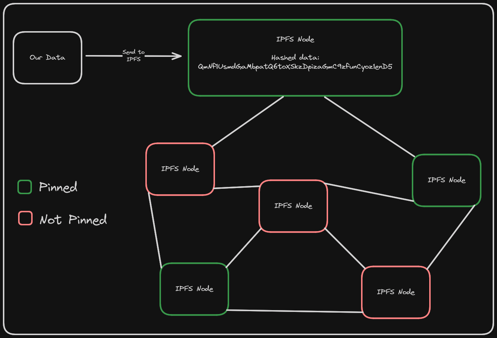

# NFTs

In this section of the course we'll be investigate Non-fungible Tokens (NFTs), we'll learn what an NFT is, why they're so cool and how to create our very own NFTs, one basic and one advanced.

## Two Flavors

As mentioned, we'll be learning two approaches to simple NFT development in this course. This first will be a basic implementation using these cute puppies!


In this first basic implementation our images are going to be stored in **[IPFS](https://ipfs.tech/)**.

With our second NFT, the art is going to be stored _on-chain_ and dynamic, changing based on a criteria we set, setting our mood from happy to sad or vice versa!


And, perhaps most excitingly, by the end of this section you'll have you're very own NFTs imported into your own wallet/metamask. You can also view them on service like OpenSea which will allow you to sell, trade, view and collect all sorts of NFTs!

## What is a NFT?

Non-fungible Tokens (NFTs) are a product of the **[ERC721 Token Standard](https://eips.ethereum.org/EIPS/eip-721)**, created on Ethereum.

NFTs are:

-   Non-fungible: This means they are explicitly unique from one another and one NFT cannot be interchanged with another

Fungible tokens, like ERC20s are similar to a dollar. Any single dollar can be swapped with any other and no value is lost. NFTs by contrast are unique in themselves with different properties from token to token.

> ❗ **PROTIP**
> Think of NFTs like Pokemon! No two Pikachus are exactly the same and there are many different types within the same class or collection. Other comparisons include: trading cards, unique pieces of art

### What's an NFT do?

Because of their unique nature, NFTs have been widely adopted as a medium for art and a means to trade and collect digital art. Sometimes this gets a bad rap, but NFTs are only a standard on which a tonne of use case functionality can be built. Some protocol turn them into representations of game assets, or into tradeble metaverse items, sometimes they're used as means to keep record, or grant access to services or events.

The use cases of NFTs grow each day, but the easiest way to think of them currently is as unique digital assets, or unique digital art.

At their core, NFTs are tokens which exist on a smart contract platform, they can be viewed, bought and sold on marketplaces such as **[OpenSea](https://opensea.io/)** and **[Rarible](https://rarible.com/)**. The marketplaces aren't required of course, but the UI/UX is generally better than a command line.

Initial reactions to NFTs are often _**"What's the point of digital pictures?"**_, but it goes beyond that. Art has value and classically it's difficult for artists to be adequately compensated, or to assure proper attribution when their work is shared. In a world where copy and paste erodes digital ownership, NFTs claw back that value and afford artists greater control of and compensation from the work they do.

### ERC721 Standard (NFTs)

NFTs, and the ERC721 Token Standard, differ from ERC20s in a few fundamental ways.

**Ownership**

ERC20s handle ownership via a simple mapping of a uint256 token balance to an address.

ERC721s, by contrast, each have a unique tokenId, these tokenIds are mapped to a user's address. In addition to a tokenId, ERC721s include a tokenUri, we'll go into more detail later, but essentially a tokenUri details the unique properties of that token, stats, images etc.

**Fungibility**

NFTs are _non-fungible_. This means each token is unique and cannot be interchanged with another. ERC20s, on the other hand, are _fungible_. Any LINK token is identical in property and value to any other LINK token.

_**What makes an NFT unique?**_

The uniqueness of an NFT token is demonstrated by it's unique tokenId as well as it's metadata/tokenUri. This is a property of an NFT which details the attributes of that token. You can imagine a character in a game, the tokenUri would be their stats page and all the details that make them an individual.

Now, when we talk about NFT representing _Art_ that comes with some implications in the blockchain space that can be pretty impactful. In Ethereum, there's a little thing called **gas**. Gas costs on ethereum make the storage of large amounts of data (like images), on-chain, prohibitively expensive in most cases.

The solution to this was the inclusion of the tokenUri within the ERC721 Standard. This serves as a property of a token which details what the asset looks like as well as any attributes associated with it. A basic tokenUri looks something like:

```js
{
    "name": "Name",
    "description": "Description",
    "image": "ImageURI",
    "attributes": []
}
```

Even this can serve to be pretty expensive, so there's a constant discuss about on-chain vs off-chain metadata. Off-chain solutions obviously come with all the pitfalls of centralization that we would expect (including losing record of what your NFT is), but the easy and savings associated with avoiding deploying this extra data are pretty appealing.

Often a protocol will use a service like **[IPFS](https://ipfs.tech/)** to hedge their bets a little bit in a more decentralized method of storage, but it too comes with its own pros and cons.

To take this consideration even further, oftentimes marketplaces won't have a means to recognize on-chain metadata since they're _so_ used to looking for a tokenUri.

In General:

-   Upload NFT Image to IPFS
-   Create metadata point to that image
-   Set the NFTs tokenUri to point to that metadata

## Foundry Setup

Now that we know what an NFT is, let's investigate how we can build our own.

To start, let's initialize our workspace. Create a new directory in your course folder.

```bash
mkdir foundry-nft
```

We can then switch to this directory and open it in VSCode.

```bash
cd foundry-nft
code .
```

Finally, we can initialize our foundry project.

```bash
forge init
```

Once initialized, be sure to remove the example contracts `src/Counter.sol`, `test/Counter.t.sol` and `script/Counter.s.sol`. Finally, assure that your `.gitignore` contains `.env` and `broadcast/`

### NFT Contracts

Now, as mentioned previously, NFTs are just another type of **[Token Standard](https://eips.ethereum.org/EIPS/eip-721)**, similar to ERC20s. As such, we could simply write our contract and begin implementing all the necessary methods to comply with this standard. However, like ERC20s, we can also just import a library (like OpenZeppelin) which does all this heavy lifting for us.

Begin by creating `src/BasicNft.sol` and setting up our usual boilerplate.

```solidity
// SPDX-License-Identifier: MIT

pragma solidity ^0.8.18;

contract BasicNft{}
```

We can install the OpenZeppelin Contracts library with:

```bash
forge install OpenZeppelin/openzeppelin-contracts --no-commit
```

To make things a little easier on ourselves, we can add this as a remapping to our `foundry.toml`. This remapping allows us to use some short-hand when importing from this directory.

```toml
[profile.default]
src = "src"
out = "out"
libs = ["lib"]
remappings = ["@openzeppelin/contracts=lib/openzeppelin-contracts/contracts"]
```

Now we can import and inherit the ERC721 contract into `BasicNft.sol`

```solidity
// SPDX-License-Identifier: MIT

import "@openzeppelin/contracts/token/ERC721/ERC721.sol";

pragma solidity ^0.8.18;

contract BasicNft is ERC721 {}
```

Your IDE will likely indicate an error until we've passed the necessary arguments to the ERC721 constructor. You can ctrl + left-click (cmd + left-click) on the imported ERC721.sol to navigate to this contract and confirm what the constructor requires.

```solidity
constructor(string memory name_, string memory symbol_) {
    _name = name_;
    _symbol = symbol_;
}
```

Just like the ERC20, we need to give our token a name and a symbol, that makes sense. Feel free to choose your own, but I'm going to go with the name `Doggie` and the symbol `DOG`.

```solidity
// SPDX-License-Identifier: MIT

import "@openzeppelin/contracts/token/ERC721/ERC721.sol";

pragma solidity ^0.8.18;

contract BasicNft is ERC721 {

    constructor() ERC721("Doggie", "DOG"){}
}
```

Great! While this contract may have the basic functionality of an NFT protocol, there's a lot to be done yet. Because each token is unique and possesses a unique tokenId, we absolutely need a token counter to track this in storage. We'll increment this each time a token is minted.

```solidity
uint256 private s_tokenCounter;

constructor() ERC721("Doggie", "DOG"){
    s_tokenCounter = 0;
}
```

### TokenURI

It's hard to believe, but once upon a time the tokenUri was once considered an optional parameter, despite being integral to how NFTs are used and consumed today.

TokenURI stands for Token Uniform Resource Identifier. At its core it serves as an endpoint that returns the metadata for a given NFT.

**Example TokenURI Metadata Schema:**

```Solidity
{
    "title": "Asset Metadata",
    "type": "object",
    "properties": {
        "name": {
            "type": "string",
            "description": "Identifies the asset to which this NFT represents"
        },
        "description": {
            "type": "string",
            "description": "Describes the asset to which this NFT represents"
        },
        "image": {
            "type": "string",
            "description": "A URI pointing to a resource with mime type image/* representing the asset to which this NFT represents. Consider making any images at a width between 320 and 1080 pixels and aspect ratio between 1.91:1 and 4:5 inclusive."
        }
    }
}
```

It's this metadata that defines what the properties of the NFT are, including what it looks like! In fact, if you go to **[OpenSea](https://opensea.io/)** and look at any NFT there, all the the data and images you're being served come from calls to the tokenURI function.

What this means to us is - any time someone mints a Doggie NFT, we need to assign a TokenURI to the minted TokenID which contains all the important information about the Doggie. Let's consider what this function would look like.

> ❗ **NOTE**
> The OpenZeppelin implementation of ERC721, which we've imported, has it's own virtual tokenURI function which we'll be overriding.

By navigating to any NFT on OpenSea, you can find a link to the collection's contract on Etherscan. Click on `Read Contract` and find the tokenURI function (here's a link to **[Pudgy Penguins](https://etherscan.io/address/0xbd3531da5cf5857e7cfaa92426877b022e612cf8#readContract)** if you need it).

Entering any valid tokenId should return the TokenURI of that NFT!


By opening this URI in your browser, the details of that token's metadata should be made available:


Note the imageURI property. This is what defines what the NFT actually looks like, you can copy this into your browser as well to view the NFT's image.


Both the tokenUri and imageUri for this example are hosted on IPFS (Inter-planetary file system), a service offering decentralized storage that we'll go into in greater detail, in the next lesson.

So what's this tokenURI function going to look like for us? Well, our BasicNFT is going to also use IPFS, so similarly to our example above, we'll need to set up our function to return this string, pointing to the correct location in IPFS.

```solidity
function tokenURI(uint256 tokenId) public view override returns (string memory) {}
```

Now, I've prepared some images you can choose from to use in your project


Create a new folder in your workspace names `images` (image) and add the image of your choice to this directory.

## IPFS

Let's dive into the Interplanetary File System (IPFS), how it works and what it means for decentralization of data. You can find additional information in the **[IPFS documentation](https://docs.ipfs.io/)**

So, how does IPFS work?

It all starts with the data we want hosted. This can be more or less anything, code, images, some other file, it doesn't matter. As we know, any data can be hashed and this is essentially what IPFS Node's do initially. We provide our data to the IPFS network via a Node and the output is a unique hash that points to the location and details of that data.

Each IPFS Node is once part of a much larger network and each of them constantly communicates to distribute data throughout the network. Any given node can choose to pin particular pieces of data to host/persist on the network.

> ❗ **NOTE**
> IPFS isn't able to execute logic or perform computation, it only serves as a means of decentralized storage

What we would do then is upload our data to IPFS and then pin it in our node, assuring that the IPFS Hash of the data is available to anyone calling the network.



Importantly, unlike a blockchain, where every node has a copy of the entire register, IPFS nodes can choose what they want to pin.

### Using IPFS

There are a few ways to actually use IPFS including a CLI installation, a browser companion and even a dedicated desktop application.

Let's go ahead and **[install the IPFS Desktop application](https://docs.ipfs.tech/install/ipfs-desktop/)**. Once installed you should be able to open the application and navigate to a files section that looks like this:


Pay no mind to all my pictures of cats. If you have no data to view, navigate to import in the top right and select any small file you don't mind being public.

> ❗ **IMPORTANT**
> Any data uploaded to this service will be _**public**_ by nature.


Once a file is uploaded, you can click on that file and view that data.


What makes this _really_ cool, is we can then copy the data's CID (content ID), as seen above and view our data within our browser by entering it into our address bar.

```Solidity
ipfs://<CID>
```

> ❗ **NOTE**
> If you're on firefox, this may not display properly as the address bar converts URLs to lowercase by default, ruining our CID. Test on Brave or Chrome.

Alternatively, if you're having trouble viewing your data directly from the IPFS network you can use the IPFS Gateway. When using a gateway, you're not directly requesting the data from the IPFS Network, you're requesting through another server which makes the request on your behalf, so it brings to question centrality and things again, but I digress. You can view the data via the Gateway with this syntax:

```Solidity
https://ipfs.io/ipfs/<CID>
```


## Upload and use IPFS data (token URI)

In a previous lesson we discussed tokenUris and I walked you through an example of viewing the TokenURI of a token on OpenSea.

```js
{
  "attributes": [
    {
      "trait_type": "Background",
      "value": "Mint"
    },
    {
      "trait_type": "Skin",
      "value": "Dark Gray"
    },
    {
      "trait_type": "Body",
      "value": "Turtleneck Pink"
    },
    {
      "trait_type": "Face",
      "value": "Blushing"
    },
    {
      "trait_type": "Head",
      "value": "Headband"
    }
  ],
  "description": "A collection 8888 Cute Chubby Pudgy Penquins sliding around on the freezing ETH blockchain.",
  "image": "ipfs://QmNf1UsmdGaMbpatQ6toXSkzDpizaGmC9zfunCyoz1enD5/penguin/420.png",
  "name": "Pudgy Penguin #420"
}
```

> ❗ **NOTE** <br />
> Notice how the `image` property has _its own_ IPFS hash! This is storing what the NFT looks like!

The Pudgy Penguins collection had been using IPFS's Gateway to access their images within the TokenURI

```js
'https://ipfs.io/ipfs/QmNf1UsmdGaMbpatQ6toXSkzDpizaGmC9zfunCyoz1enD5/penguin/420.png';
```

This works, and is often leveraged due to browser compatibily with IPFS, but it's worth noting that this is pointing to a centralized server. If that server goes down, the image data will be unretrievable via the tokenURI call!

A more decentralized way to retrieve the image data is by pointing to the IPFS netwok itself.

```js
'ipfs://QmNf1UsmdGaMbpatQ6toXSkzDpizaGmC9zfunCyoz1enD5/penguin/420.png';
```

### Doggies

With a better understanding of IPFS and decentralized storage in hand, let get back to our BasicNFT contract. If you want, you can upload your image to IPFS to acquire your own hash. Alternatively, if you want to make things easy on yourself:

```js
'ipfs://bafybeig37ioir76s7mg5oobetncojcm3c3hxasyd4rvid4jqhy4gkaheg4/?filename=0-PUG.json';
```

If you view this in your browser or through the IPFS Desktop App, you should see the tokenURI of our Doggie NFT, it's even got an image assigned already.

> ❗ **PROTIP** <br />
> If you do decide to upload your own data to IPFS, you'll need to upload your image first to acquire an imageURI/hash. You'll then upload a tokenURI json containing this pointer to your image.

```js
{
    "name": "PUG",
    "description": "An adorable PUG pup!",
    "image": "https://ipfs.io/ipfs/QmSsYRx3LpDAb1GZQm7zZ1AuHZjfbPkD6J7s9r41xu1mf8?filename=pug.png",
    "attributes": [
        {
            "trait_type": "cuteness",
            "value": 100
        }
    ]
}
```

Now, we could just paste the about tokenURI as a return value of our tokenUri function, but this would mint every Doggie identical to eachother. Let's spice things up a little bit and allow the user to choose what their NFT looks like. We'll do this by allowing the user to pass a tokenUri to the mint function and mapping this URI to their minted tokenId.

```js
contract BasicNFT is ERC721 {
    uint256 private s_tokenCounter;
    mapping(uint256 => string) private s_tokenIdToUri;

    constructor() ERC721("BasicNFT", "BFT") {
        s_tokenCounter = 0;
    }

    function mintNFT(string memory tokenUri) public returns (uint256) {
        s_tokenIdToUri[s_tokenCounter] = tokenUri;
    }

    function tokenURI(
        uint256 tokenId
    ) public view override returns (string memory) {
        return s_tokenIdToUri[tokenId];
    }
}
```

Great! All that's missing is to mint the NFT and increment our token counter. We can mint the token by calling the inherited \_safeMint function.

```js
contract BasicNFT is ERC721 {
    uint256 private s_tokenCounter;
    mapping(uint256 => string) private s_tokenIdToUri;

    constructor() ERC721("BasicNFT", "BFT") {
        s_tokenCounter = 0;
    }

    function mintNFT(string memory tokenUri) public returns (uint256) {
        s_tokenIdToUri[s_tokenCounter] = tokenUri;
        _safeMint(msg.sender, s_tokenCounter);
        s_tokenCounter++;
    }

    function tokenURI(
        uint256 tokenId
    ) public view override returns (string memory) {
        return s_tokenIdToUri[tokenId];
    }
}
```

## Deploy Script

The muscle memory should be kicking in for some of these deploy scripts by now. Let's not waste any time setting this one up! Create a new file `script/DeployBasicNft.s.sol`.

```js
// SPDX-License-Identifier: MIT

pragma solidity ^0.8.18;

import {Script} from "forge-std/Script.sol";
import {BasicNft} from "../src/BasicNft.sol";

contract DeployBasicNft is Script {
    function run() external returns (BasicNft){
        vm.startBroadcast();
        BasicNft basicNft = new BasicNft();
        vm.stopBroadcast();
        return basicNft;
    }
}
```

That's literally all there is to it. Run a quick `forge compile` as a sanity check to assure things build.

## Test the NFTs smart contract

Once the setup is complete, it's time to jump into tests. Writing an array of tests serves to validate the functionality of our contract, we'll start with something simple and verify that our NFT name is set correctly.

Start with the usual boilerplate for our test contract. Create the file `test/BasicNftTest.t.sol`. Our test contract will need to import BasicNft, and our deploy script as well as import and inherit Foundry's `Test.sol`.

```js
//SPDX-License-Identifier: MIT

pragma solidity ^0.8.18;

import {Test} from "forge-std/Test.sol";
import {BasicNFT} from "../src/BasicNFT.sol";
import {DeployBasicNft} from "../script/DeployBasicNFT.s.sol";

contract BasicNFTTest is Test {
  DeployBasicNft public deployer;
  BasicNFT public basicNft;

  function setUp() public {
      deployer = new DeployBasicNft();
      basicNft = deployer.run();
  }
}
```

To confirm that the Name of your NFT is correct, declare a function `testNameIsCorrect` and specify it as public view.

```js
function testNameIsCorrect() public view {
  string memory expected = "Doggie";
  string memory actual = basicNft.name();
  assert(expected == actual);
}
```

Now, you may believe that we can simply do something like the above. We know the ERC721 standard allows us to call the `name` function to verify what what set, so that should be it, right?

We actually run into an issue here.


### Comparing Strings

If you recall from previous lessons, strings are actually a special data type. Under the hood, strings exist as an array of bytes, arrays can't be compared to arrays in this way, this is limited to primitive data types. Primitive data types include things like int, bool, bytes32, address etc.

So, how do we compare these strings? Since it's an array, we could loop through the elements of the array and compare each of them. This is entirely doable, but it's computationally expensive and going take a long time if the strings were very large!

A more elegant approach would be to encode each of our string objects into a hash and compare the hashes.

This is a point where I may use Foundry's tool, chisel, to sanity check myself as I go.

```bash
chisel
```

Use chisel to create a couple simple strings

```bash
string memory cat = "cat";
string memory dog = "dog";
```

Now if you type `cat`, you should get a kinda crazy output that's representing the hex of that string.


We'll leverage abi.encodePacked to convert this to bytes, then finally we can use keccak256 to hash the value into bytes32, which we can can use in our value comparison.


> ❗ **NOTE**
> I know we haven't covered encoding or abi.encodePacked in great detail yet, but don't worry - we will.

If we apply this encoding and hashing methodology to our BasicNft test, we should come out with something that looks like this:

```js
function testNameIsCorrect() public view {
  string memory expectedName = "Doggie";
  string memory actualName = basicNft.name();

  assert(keccak256(abi.encodePacked(expectedName)) == keccak256(abi.encodePacked(actualName)));
}
```

In the above, we're encoding and hashing both of our strings before comparing them in our assertion. Now, if we run our test with `forge test --mt testNameIsCorrect`...


Great work! Let's write a couple more tests together.

### Testing Mint and Balance

The next test we write will assure a user can mint the NFT and then change the user's balance. We'll need to create a user to prank in our test. Additionally, we'll need to provide our mint function a tokenUri, I've provided one below for convenience. If you've one prepared from the previous lesson, feel free to use it!

```js
contract BasicNftTest is Test {
  ...
  address public USER = makeAddr("user");
  string public constant PUG =
      "ipfs://bafybeig37ioir76s7mg5oobetncojcm3c3hxasyd4rvid4jqhy4gkaheg4/?filename=0-PUG.json";
  ...
  function testCanMintAndHaveABalance() public {
    vm.prank(USER);
    basicNft.mintNft(PUG);

    assert(basicNft.balanceOf(USER) == 1);
    assert(keccak256(abi.encodePacked(PUG)) == keccak256(abi.encodePacked(basicNft.tokenURI(0))));
  }
}
```

With this, we again should just be able to run `forge test` and see how things resolve.


## Basic NFT Interactions

Alright, with our tests passing we're going to want a way to interact with our contract programmatically. We could use `cast` commands, but let's write an interactions script instead. Create the file `script/Interactions.s.sol`. You know the drill for our boilerplate by now.

```js
// SPDX-License-Identifier: MIT

pragma solidity ^0.8.18;

import {Script} from "forge-std/Script.sol";

contract MintBasicNft is Script{
    function run() external {}
}
```

We know we'll always want to be interacting with the latest deployment, so let's install the `foundry-devops` library to help with this.

```bash
forge install Cyfrin/foundry-devops --no-commit
```

Now, we can import `DevOpsTools` and use this to acquire our most recent deployment. We'll use this address as a parameter for the `mint` function we'll call.

> ❗ **NOTE**
> I've copied over my `PUG tokenUri` for use in our `mint` function, remember to copy your own over too!

```js
// SPDX-License-Identifier: MIT

pragma solidity ^0.8.18;

import {Script} from "forge-std/Script.sol";
import {BasicNft} from "../src/BasicNft.sol";
import {DevOpsTools} from "lib/foundry-devops/src/DevOpsTools.sol";

contract MintBasicNft is Script{

    string public constant TOKENURI =
        "ipfs://bafybeig37ioir76s7mg5oobetncojcm3c3hxasyd4rvid4jqhy4gkaheg4/?filename=0-PUG.json";

    function run() external {
        address mostRecentlyDeployed = DevOpsTools.get_most_recent_deployment("BasicNft", block.chainid);

        mintNftOnContract(mostRecentlyDeployed);
    }

    function mintNftOnContract(address contractAddress) public {
        vm.startBroadcast();
        BasicNft(contractAddress).mintNft(TOKENURI);
        vm.stopBroadcast();
    }
}
```

> ❗ **PROTIP**
> Remember, if you don't recall which parameters are required for a function like `get_most_recent_deployment` you can `ctrl + left-click` (`cmd + click`) to be brought to the function definition.

## Basic NFT Testnet Demo

Seeing our NFT minting in our tests is cool and all, but to really appreciate them, we want to see them in our wallet. We want to see the art _in_ Metamask, _on_ OpenSea, we gotta make it real.

So let's do that.

Before we get started, I'll mention you don't _have_ to do this yourself. This process will cost testnet funds, so it's fine to just follow along if needed. An alternative way to view your NFT would be to import your Anvil chain into Metamask and continue to use your local blockchain. If that works for you, great! Otherwise, let's continue with deploying this on an actual testnet.

We'll be leveraging a Makefile for this again, I'll just be copying mine from the GitHub repo associated with this course, I've also provided it below for your convenience.

Makefile:

```make
-include .env

.PHONY: all test clean deploy fund help install snapshot format anvil

DEFAULT_ANVIL_KEY := 0xac0974bec39a17e36ba4a6b4d238ff944bacb478cbed5efcae784d7bf4f2ff80

help:
	@echo "Usage:"
	@echo "  make deploy [ARGS=...]\n    example: make deploy ARGS=\"--network sepolia\""
	@echo ""
	@echo "  make fund [ARGS=...]\n    example: make deploy ARGS=\"--network sepolia\""

all: clean remove install update build

# Clean the repo
clean  :; forge clean

# Remove modules
remove :; rm -rf .gitmodules && rm -rf .git/modules/* && rm -rf lib && touch .gitmodules && git add . && git commit -m "modules"

install :; forge install Cyfrin/foundry-devops@0.0.11 --no-commit && forge install foundry-rs/forge-std@v1.5.3 --no-commit && forge install openzeppelin/openzeppelin-contracts@v4.8.3 --no-commit

# Update Dependencies
update:; forge update

build:; forge build

test :; forge test

snapshot :; forge snapshot

format :; forge fmt

anvil :; anvil -m 'test test test test test test test test test test test junk' --steps-tracing --block-time 1

NETWORK_ARGS := --rpc-url http://localhost:8545 --private-key $(DEFAULT_ANVIL_KEY) --broadcast

ifeq ($(findstring --network sepolia,$(ARGS)),--network sepolia)
	NETWORK_ARGS := --rpc-url $(SEPOLIA_RPC_URL) --private-key $(PRIVATE_KEY) --broadcast --verify --etherscan-api-key $(ETHERSCAN_API_KEY) -vvvv
endif

deploy:
	@forge script script/DeployBasicNft.s.sol:DeployBasicNft $(NETWORK_ARGS)

Mint:
    @forge script script/Interactions.s.sol:MintNFT ${NETWORK_ARGS}

deployMood:
	@forge script script/DeployMoodNft.s.sol:DeployMoodNft $(NETWORK_ARGS)

mintMoodNft:
	@forge script script/Interactions.s.sol:MintMoodNft $(NETWORK_ARGS)

flipMoodNft:
	@forge script script/Interactions.s.sol:FlipMoodNft $(NETWORK_ARGS)
```

Assuming our `.env` is ready to go, we should be able to run the following...

> ❗ **PROTIP**
> Remember to add the required environment variables if necessary. You should need a `sepolia RPC-URL`, an `account private key` and an `etherscan api key`.

```bash
make deploy ARGS="--network sepolia"
```


With a contract deployed, this transaction data, including the contract address is added to our `broadcast` folder within run-latest.json. This is how our `DevOpsTool` acquires the most recent contract deployment. We should now be able to use our `Interactions.s.sol` script to mint ourselves an NFT.

> ❗ **IMPORTANT**
> Add `fs_permissions = [{ access = "read", path = "./broadcast" }]` to your `foundry.toml` or DevOpsTools won't have the permissions necessary to function correctly! This is more safe than `FFI=true`.

```bash
make mint ARGS="--network sepolia"
```

While this is minting, we can navigate to our Metamask wallet and import our NFT Token. Grab the address of the contract we deployed from Etherscan (or `broadcast/DeployBasicNft.s.sol/11155111/run-latest.json`).


Enter the contract address and a tokenId of `0` when prompted. Then, after a brief wait...


We can see our NFT in our wallet!!!

### Wrap Up

Amazing work! We've deployed an NFT protocol to a testnet, we've minted ourselves an NFT programmatically, and we've imported that Token right into our wallet. Our adorable Pup is our to do with as we please!

We've learnt so much already and you should be very proud, but it's not time to stop yet. In the next lesson we'll discuss the pros and cons of data storage and the services and methodologies available to us.


While testing is a vital part of NFT creation, deploying it in a real use case can bring more clarity to your understanding. Luckily, there are several ways to deploy your NFT. You could consider using Anvil, your own Anvil server, or a testnet. If you're not keen on waiting for the testnet or spending the gas, I'd recommend deploying it to Anvil.

The processes detailed below are optional, but feel free to follow along if you'd like.

### Using a Makefile for Quick Deployment

Rather than typing out long scripts, we'll use a makefile here. The associated Git repo contains the makefile we're using, allowing you to simply copy and paste rather than rewriting everything.

In the makefile, we've captured most of the topics we've discussed so far, including our deploy script, which we'll use to deploy our basic NFT.

Here is what the deploy script looks like:

```makefile
deploy:
	@forge script script/DeployBasicNft.s.sol:DeployBasicNft $(NETWORK_ARGS)
```

It's important here to ensure you have included your environmental variables.

It's noteworthy that you should write some tests before deploying on a testnet, although for the sake of showing you what the NFT looks like, we'll skip this step in this instance.

## Deploying Our Basic NFT

We're now going to deploy our basic NFT to the contract address. After successful deployment, there will be a short wait for its verification.

### Extracting Contract Info and Minting

With our NFT deployed, we'll now move to extract our contract data. In the broadcast folder, the latest run contains the created basic NFT information. We'll execute the following command to initiate the Mint function:

```makefile
mint:
    @forge script script/Interactions.s.sol:Interactions $(NETWORK_ARGS)
```

The DevOps tool works by grabbing the most recent contract from this folder, thus automating the process.

## Importing NFT into MetaMask

While the NFT is being minted, let's transition to MetaMask:

1. Copy the contract address under which the NFT was deployed.
2. From MetaMask, go to NFTs and switch to Sepolia.
3. Click on Import NFTs and paste the copied address.
4. Since we're the first to create this NFT, the token ID will be zero. Input this and hit 'Add'.

After a short wait, your NFT will be viewable right from your MetaMask wallet. It's intelligent enough to extract the token URI, allowing you to view the image, contract address, or send it elsewhere.

Congratulations! You've successfully deployed and imported an NFT into MetaMask. You can now interact with it just as you would in a marketplace like OpenSea. Through this process, you've learned how to make an NFT come to life, from being just a script to being part of the real-world, bridging the gap between test environments and real applications.

Stay tuned for our next post on advanced NFT creation steps, such as a complete DeFi app development and more.

## IPFS and Pinata vs HTTP vs on chain SVGs

### The issue with IPFS vs HTTPS

In this lesson we'll discuss two ways we can reference our data in `IPFS` and ways we can strengthen the hosting of it to ensure it's always made available.

First things first: Let's discuss the **InterPlanetary File System (IPFS)** and the pros and cons associated with it.

### IPFS

We learnt previously that there are two ways to reference the location of data hosted by `IPFS`. We can point directly to the `IPFS` network with the syntax `ipfs://<CID>` _or_ we can use the `IPFS Gateway` and point to an IPFS server via `https://ipfs.io/ipfs/<CID>`.

There are some important considerations to keep in mind here. If we decide to use the `IPFS Gateway`, this is essentially pointing to a website hosted on a server by `IPFS`. If this website or server goes down for any reason the data we're pointing to will be unretrievable!

Imagine losing the art of your NFT forever!

A safer methodology is pointing to the `IPFS` network directly, but this comes with caveats. While the URI is pointing to a decentralized network, assuring the data is accessible so long as a node is still hosting it, most browsers and services don't natively support interfacing with the `IPFS` network. This can make viewing and interacting with your NFT cumbersome.

In addition to the above, the `IPFS` network doesn't automatically distribute all data amongst all nodes on the network (like a blockchain would). Instead it relies on nodes pinning the data they find valuable to assure it's available to the rest of the network. If I'm the only person pinning my data on `IPFS`, I'm not any more decentralized than using the `IPFS Gateway`.

_**So, how do we solve this?**_

### Pinning Services

Fortunately, there are services available which developers can use to pin their data for them, decentralizing access to it. One such service is **[Pinata.cloud](https://www.pinata.cloud/)**.


Once an account is created and you've logged in, the UI functions much like an `IPFS` node and you can simply upload any files you want the service to pin on your behalf.


Once uploaded, `Pinata` will provide a `CID`, just like `IPFS` itself will.


> ❗ **PROTIP**
> Whenever I work on a project, I will upload my images/data both to my local `IPFS` node as well as `Pinata` to assure the data is always pinned _somewhere_.


## What is an SVG?

o understand what an `SVG` is, we'll dive right into a helpful tutorial from our friends at [W3Schools](https://www.w3schools.com/graphics/svg_intro.asp). SVG stands for `Scalable Vector Graphics`. In 'simple' terms, SVG is a way to define images in a two-dimensional space using XML coded tags with specific parameters.

**SVG Example:**

```js
<html>
	<body>
		<h1>My first SVG</h1>

		<svg
			width="100"
			height="100"
			xmlns="http://www.w3.org/2000/svg"
		>
			<circle
				cx="50"
				cy="50"
				r="40"
				stroke="green"
				stroke-width="4"
				fill="yellow"
			/>
		</svg>
	</body>
</html>
```


SVGs are awesome because they maintain their quality, no matter what size you make them. If you stretch a traditional image file like a .jpg or .png, they become pixelated and lose clarity. SVGs don’t suffer from this issue because they’re scalable. They’re defined within an exact parameter, thus maintaining their quality regardless of scale.

I encourage you to play with editing the parameters in the **[W3Schools SVG Demo](https://www.w3schools.com/graphics/tryit.asp?filename=trysvg_myfirst)**. Experiment with how the different parameters can change your image! There's lots of documentation on that website detailing all the tags and features one could add to an SVG.

## Creating Your Own SVG

Let's look at how we can create our own simple SVG, right in our IDE. Create the file `img/example.svg`. We can use the `<svg>` tag to define what our simple image will look like.

```js
<svg
	xmlns="http://www.w3.org/2000/svg"
	width="500"
	height="500"
>
	<text
		x="200"
		y="250"
		fill="white"
	>
		Hi! You decoded this!{' '}
	</text>
</svg>
```

> ❗ **IMPORTANT**
> You will likely need to download a SVG preview extension to view the SVG in your IDE. I recommend trying **[SVG Preview](https://marketplace.visualstudio.com/items?itemName=SimonSiefke.svg-preview)**.


Importantly, this SVG code _**is not**_ a URI, but we can convert this into a URI that a browser can understand by passing all the necessary data through the URL of our browser.

### Converting to a URI

In your terminal, enter the command `base64 --help` to determine if you have base64 installed, this isn't compatible with all computers, so if you don't have it available, you can copy the encoding I've provided below.

For those with base64 installed, first switch to your `img` directory.

```bash
cd img
```

Then run the following command to pass our example.svg as a file to the base64 command:

```bash
base64 -i example.svg
```

You should get an output like this (those without base64 can copy and paste this value):

```bash
PHN2ZyB4bWxucz0iaHR0cDovL3d3dy53My5vcmcvMjAwMC9zdmciIHdpZHRoPSI1MDAiIGhlaWdodD0iNTAwIj4KPHRleHQgeD0iMjAwIiB5PSIyNTAiIGZpbGw9IndoaXRlIj5IaSEgWW91IGRlY29kZWQgdGhpcyEgPC90ZXh0Pgo8L3N2Zz4=
```

This weird output is the base64 encoded example.svg. We can now add a prefix which tells our browser what type of data this is, `data:image/svg+xml,base64,`.

Copy this whole string into your browser and you should see our SVG!

```bash
data:image/svg+xml;base64,PHN2ZyB4bWxucz0iaHR0cDovL3d3dy53My5vcmcvMjAwMC9zdmciIHdpZHRoPSI1MDAiIGhlaWdodD0iNTAwIj4KPHRleHQgeD0iMjAwIiB5PSIyNTAiIGZpbGw9IndoaXRlIj5IaSEgWW91IGRlY29kZWQgdGhpcyEgPC90ZXh0Pgo8L3N2Zz4=
```


This same process can be applied to our SVG images for our NFTs. You can navigate to the **[GitHub Repo](https://github.com/Cyfrin/foundry-nft-f23/blob/main/images/dynamicNft/happy.svg?short_path=224d82e)** to see the code which represents our happy and sad SVGs.

**Happy.svg**

```js
<svg
	viewBox="0 0 200 200"
	width="400"
	height="400"
	xmlns="http://www.w3.org/2000/svg"
>
	<circle
		cx="100"
		cy="100"
		fill="yellow"
		r="78"
		stroke="black"
		stroke-width="3"
	/>
	<g class="eyes">
		<circle
			cx="61"
			cy="82"
			r="12"
		/>
		<circle
			cx="127"
			cy="82"
			r="12"
		/>
	</g>
	<path
		d="m136.81 116.53c.69 26.17-64.11 42-81.52-.73"
		style="fill:none; stroke: black; stroke-width: 3;"
	/>
</svg>
```

> ❗ **PROTIP**
> If you don't have happy.svg and sad.svg images within your img folder, now would be a great time to create them! Copy the SVG code from the **[GitHub Repo](https://github.com/Cyfrin/foundry-nft-f23/tree/main/images/dynamicNft)**!

Once we have both of these images in our workspace, we can run our base64 commands to encode them (those without base64, feel free to grab the encodings below):

```bash
base64 -i images/what-is-svg/happy.svg
PHN2ZyB2aWV3Qm94PSIwIDAgMjAwIDIwMCIgd2lkdGg9IjQwMCIgIGhlaWdodD0iNDAwIiB4bWxu
cz0iaHR0cDovL3d3dy53My5vcmcvMjAwMC9zdmciPg0KICA8Y2lyY2xlIGN4PSIxMDAiIGN5PSIx
MDAiIGZpbGw9InllbGxvdyIgcj0iNzgiIHN0cm9rZT0iYmxhY2siIHN0cm9rZS13aWR0aD0iMyIv
Pg0KICA8ZyBjbGFzcz0iZXllcyI+DQogICAgPGNpcmNsZSBjeD0iNzAiIGN5PSI4MiIgcj0iMTIi
Lz4NCiAgICA8Y2lyY2xlIGN4PSIxMjciIGN5PSI4MiIgcj0iMTIiLz4NCiAgPC9nPg0KICA8cGF0
aCBkPSJtMTM2LjgxIDExNi41M2MuNjkgMjYuMTctNjQuMTEgNDItODEuNTItLjczIiBzdHlsZT0i
ZmlsbDpub25lOyBzdHJva2U6IGJsYWNrOyBzdHJva2Utd2lkdGg6IDM7Ii8+DQo8L3N2Zz4=

base64 -i images/what-is-svg/sad.svg
PD94bWwgdmVyc2lvbj0iMS4wIiBzdGFuZGFsb25lPSJubyI/Pg0KPHN2ZyB3aWR0aD0iMTAyNHB4
IiBoZWlnaHQ9IjEwMjRweCIgdmlld0JveD0iMCAwIDEwMjQgMTAyNCIgeG1sbnM9Imh0dHA6Ly93
d3cudzMub3JnLzIwMDAvc3ZnIj4NCiAgPHBhdGggZmlsbD0iIzMzMyIgZD0iTTUxMiA2NEMyNjQu
NiA2NCA2NCAyNjQuNiA2NCA1MTJzMjAwLjYgNDQ4IDQ0OCA0NDggNDQ4LTIwMC42IDQ0OC00NDhT
NzU5LjQgNjQgNTEyIDY0em0wIDgyMGMtMjA1LjQgMC0zNzItMTY2LjYtMzcyLTM3MnMxNjYuNi0z
NzIgMzcyLTM3MiAzNzIgMTY2LjYgMzcyIDM3Mi0xNjYuNiAzNzItMzcyIDM3MnoiLz4NCiAgPHBh
dGggZmlsbD0iI0U2RTZFNiIgZD0iTTUxMiAxNDBjLTIwNS40IDAtMzcyIDE2Ni42LTM3MiAzNzJz
MTY2LjYgMzcyIDM3MiAzNzIgMzcyLTE2Ni42IDM3Mi0zNzItMTY2LjYtMzcyLTM3Mi0zNzJ6TTI4
OCA0MjFhNDguMDEgNDguMDEgMCAwIDEgOTYgMCA0OC4wMSA0OC4wMSAwIDAgMS05NiAwem0zNzYg
MjcyaC00OC4xYy00LjIgMC03LjgtMy4yLTguMS03LjRDNjA0IDYzNi4xIDU2Mi41IDU5NyA1MTIg
NTk3cy05Mi4xIDM5LjEtOTUuOCA4OC42Yy0uMyA0LjItMy45IDcuNC04LjEgNy40SDM2MGE4IDgg
MCAwIDEtOC04LjRjNC40LTg0LjMgNzQuNS0xNTEuNiAxNjAtMTUxLjZzMTU1LjYgNjcuMyAxNjAg
MTUxLjZhOCA4IDAgMCAxLTggOC40em0yNC0yMjRhNDguMDEgNDguMDEgMCAwIDEgMC05NiA0OC4w
MSA0OC4wMSAwIDAgMSAwIDk2eiIvPg0KICA8cGF0aCBmaWxsPSIjMzMzIiBkPSJNMjg4IDQyMWE0
OCA0OCAwIDEgMCA5NiAwIDQ4IDQ4IDAgMSAwLTk2IDB6bTIyNCAxMTJjLTg1LjUgMC0xNTUuNiA2
Ny4zLTE2MCAxNTEuNmE4IDggMCAwIDAgOCA4LjRoNDguMWM0LjIgMCA3LjgtMy4yIDguMS03LjQg
My43LTQ5LjUgNDUuMy04OC42IDk1LjgtODguNnM5MiAzOS4xIDk1LjggODguNmMuMyA0LjIgMy45
IDcuNCA4LjEgNy40SDY2NGE4IDggMCAwIDAgOC04LjRDNjY3LjYgNjAwLjMgNTk3LjUgNTMzIDUx
MiA1MzN6bTEyOC0xMTJhNDggNDggMCAxIDAgOTYgMCA0OCA0OCAwIDEgMC05NiAweiIvPg0KPC9z
dmc+
```

Append our prefix `data:image/svg+xml;base64,` and view the images in your browser to assure things are working as expected!

## Create a dynamic NFTs collection

Ok, we've gained lots of context and understand about data storage in general and the benefits of `SVGs` specifically. Let's begin creating our very own dynamic `MoodNFT` with its `SVG` art stored on-chain.

At the core of the NFT we'll build is a `flipMood` function which allows the owner to flip their NFT between happy and sad images.


Start with creating the file `src/MoodNFT.sol` and filling out the usual boilerplate. We're definitely getting good at this by now.

```js
// SPDX-License-Identifier: MIT

pragma solidity ^0.8.18;

import "@openzeppelin/contracts/token/ERC721/ERC721.sol";

contract MoodNFT is ERC721 {
    constructor() ERC721("Mood NFT", "MN"){}
}
```

Looking good! We want to store the `SVG` art on chain, we're actually going to pass these to our `constructor` on deployment.

```js
constructor(string memory sadSvg, string memory happySvg) ERC721("Mood NFT", "MN"){}
```

We know we'll need a `tokenCounter`, along with this let's declare our `sadSvg` and `happySvg` as storage variables as well. All together, before getting into our functions, things should look like this:

```js
// SPDX-License-Identifier: MIT

pragma solidity ^0.8.18;

import "@openzeppelin/contracts/token/ERC721/ERC721.sol";

contract MoodNFT is ERC721 {
    string private s_sadSvgImageUri;
    string private s_happySvgImageUri;
    uint256 private s_tokenCounter;

    constructor(string memory sadSvgImageUri, string memory happySvgImageUri) ERC721("Mood NFT", "MN"){
        s_tokenCounter = 0;
        s_sadSvgImageUri = sadSvgImageUri;
        s_happySvgImageUri = happySvgImageUri;
    }
}
```

Now we need a `mint` function, anyone should be able to call it, so it should definitely be `public`. This shouldn't be anything especially new to us so far.

```js
function mintNft() public {
    _safeMint(msg.sender, s_tokenCounter);
    s_tokenCounter++;
}
```

And now the moment of truth! As we write the `tokenURI` function, we know this is what defines what our NFT looks like and the metadata associated with it. Remember that we'll need to `override` this `virtual` function of the `ERC721` standard.

```js
function tokenURI(uint256 tokenId) public view override returns (string memory){}
```

## Encoding SVGs to be stored onchain

Before we even begin, I want to say you _can_ pass the SVG itself to a constructor and encode it on-chain (and I'll show you how this works a bit later), but if we encode the SVG with base64 _first_ and pass this to our constructor, it'll save us a step.

Here's the encoded SVGs again for those without base64 installed.

```bash
HappySVG:
data:image/svg+xml;base64,PHN2ZyB2aWV3Qm94PSIwIDAgMjAwIDIwMCIgd2lkdGg9IjQwMCIgIGhlaWdodD0iNDAwIiB4bWxucz0iaHR0cDovL3d3dy53My5vcmcvMjAwMC9zdmciPgogIDxjaXJjbGUgY3g9IjEwMCIgY3k9IjEwMCIgZmlsbD0ieWVsbG93IiByPSI3OCIgc3Ryb2tlPSJibGFjayIgc3Ryb2tlLXdpZHRoPSIzIi8CiAgPGcgY2xhc3M9ImV5ZXMiPgogICAgPGNpcmNsZSBjeD0iNjEiIGN5PSI4MiIgcj0iMTIiLz4KICAgIDxjaXJjbGUgY3g9IjEyNyIgY3k9IjgyIiByPSIxMiIvPgogIDwvZz4KICA8cGF0aCBkPSJtMTM2LjgxIDExNi41M2MuNjkgMjYuMTctNjQuMTEgNDItODEuNTItLjczIiBzdHlsZT0iZmlsbDpub25lOyBzdHJva2U6IGJsYWNrOyBzdHJva2Utd2lkdGg6IDM7Ii8+Cjwvc3ZnPg==

SadSVG:
data:image/svg+xml;base64,PHN2ZyB3aWR0aD0iMTAyNHB4IiBoZWlnaHQ9IjEwMjRweCIgdmlld0JveD0iMCAwIDEwMjQgMTAyNCIgeG1sbnM9Imh0dHA6Ly93d3cudzMub3JnLzIwMDAvc3ZnIj4KICA8cGF0aCBmaWxsPSIjMzMzIiBkPSJNNTEyIDY0QzI2NC42IDY0IDY0IDI2NC42IDY0IDUxMnMyMDAuNiA0NDggNDQ4IDQ0OCA0NDgtMjAwLjYgNDQ4LTQ0OFM3NTkuNCA2NCA1MTIgNjR6bTAgODIwYy0yMDUuNCAwLTM3Mi0xNjYuNi0zNzItMzcyczE2Ni42LTM3MiAzNzItMzcyIDM3MiAxNjYuNiAzNzIgMzcyLTE2Ni42IDM3Mi0zNzIgMzcyeiIvPgogIDxwYXRoIGZpbGw9IiNFNkU2RTYiIGQ9Ik01MTIgMTQwYy0yMDUuNCAwLTM3MiAxNjYuNi0zNzIgMzcyczE2Ni42IDM3MiAzNzIgMzcyIDM3Mi0xNjYuNiAzNzItMzcyLTE2Ni42LTM3Mi0zNzItMzcyek0yODggNDIxYTQ4LjAxIDQ4LjAxIDAgMCAxIDk2IDAgNDguMDEgNDguMDEgMCAwIDEtOTYgMHptMzc2IDI3MmgtNDguMWMtNC4yIDAtNy44LTMuMi04LjEtNy40QzYwNCA2MzYuMSA1NjIuNSA1OTcgNTEyIDU5N3MtOTIuMSAzOS4xLTk1LjggODguNmMtLjMgNC4yLTMuOSA3LjQtOC4xIDcuNEgzNjBhOCA4IDAgMCAxLTgtOC40YzQuNC04NC4zIDc0LjUtMTUxLjYgMTYwLTE1MS42czE1NS42IDY3LjMgMTYwIDE1MS42YTggOCAwIDAgMS04IDguNHptMjQtMjI0YTQ4LjAxIDQ4LjAxIDAgMCAxIDAtOTYgNDguMDEgNDguMDEgMCAwIDEgMCA5NnoiLz4KICA8cGF0aCBmaWxsPSIjMzMzIiBkPSJNMjg4IDQyMWE0OCA0OCAwIDEgMCA5NiAwIDQ4IDQ4IDAgMSAwLTk2IDB6bTIyNCAxMTJjLTg1LjUgMC0xNTUuNiA2Ny4zLTE2MCAxNTEuNmE4IDggMCAwIDAgOCA4LjRoNDguMWM0LjIgMCA3LjgtMy4yIDguMS03LjQgMy43LTQ5LjUgNDUuMy04OC42IDk1LjgtODguNnM5MiAzOS4xIDk1LjggODguNmMuMyA0LjIgMy45IDcuNCA4LjEgNy40SDY2NGE4IDggMCAwIDAgOC04LjRDNjY3LjYgNjAwLjMgNTk3LjUgNTMzIDUxMiA1MzN6bTEyOC0xMTJhNDggNDggMCAxIDAgOTYgMCA0OCA0OCAwIDEgMC05NiAweiIvPgo8L3N2Zz4=
```

> ❗ **NOTE**
> Those who have decided to use their own custom SVG images, remember you can acquire the encoding with the command `base64 -i <filename>` while in the `img` directory!

Now, if we're going to be passing _already encoded_ imageURIs to our constructor, it's probably a good idea to adjust the naming of our storage variables for clarity. Let's do this before moving on.

```js
contract MoodNFT is ERC721 {
    uint256 private s_tokenCounter;
    string private s_sadSvgImageUri;
    string private s_happySvgImageUri;

    constructor(string memory sadSvgImageUri, string memory happySvgImageUri) ERC721("Mood NFT", "MN"){
        s_sadSvgImageUri = sadSvgImageUri;
        s_happySvgImageUri = happySvgImageUri
    }
}
```

> ❗ **IMPORTANT** > **tokenURI != imageURI**
>
> It's important to remember that imageURI is one property of a token's tokenURI. A tokenURI is usually a JSON object!

At this point you may be asking, if the tokenURI is a JSON object, how do we store this on-chain? The answer: We can encode it in much the same way!

OpenZeppelin actually offers a **[Utilities](https://docs.openzeppelin.com/contracts/4.x/utilities)** package which includes a Base64 function which we can leverage to encode our tokenURI on-chain.

We've already got OpenZeppelin contracts installed, so we can just import Base64 into our NFT contract.

```js
import { Base64 } from '@openzeppelin/contracts/utils/Base64.sol';
```

Let's start off our tokenURI function by defining a variable, `string memory tokenMetadata`. We can set this equal to our JSON object in string format like so:

```js
string memory tokenMetadata = abi.encodePacked(
    '{"name: "',
    name(),
    '", description: "An NFT that reflects your mood!", "attributes": [{"trait_type": "Mood", "value": 100}], "image": ',
    imageURI,
    '"}'
)
```

In the above, we're using `abi.encodePacked` to concatenate our disparate strings into one object. This allows us to easily parameterize things a little bit.

In order to determine our imageURI we'll need to derive this from the mood which has been set to our NFT token. As such, we're going to need a way to track the mood of each token. This sounds like a mapping to me. We can even spice it up a little bit and map our choice to an `enum`, which would allow someone to set more moods, if they wanted to expand on things in the future.

```js
contract MoodNFT is ERC721 {
    uint256 private s_tokenCounter;
    string private s_sadSvgImageUri;
    string private s_happySvgImageUri;

    enum Mood {
        HAPPY,
        SAD
    }

    mapping(uint256 => Mood) private s_tokenIdToMood;
}
```

When an NFT is minted, they'll need a default mood, let's default them to happy.

```js
function mintNft() public {
    _safeMint(msg.sender, s_tokenCounter);
    s_tokenIdToMood[s_tokenCounter] = Mood.HAPPY;
    s_tokenCounter++;
}
```

Now, back in our tokenURI function, we can define a conditional statement which will derive what our imageURI should be.

```js
function tokenURI(uint256 tokenId) public view override returns (string memory){
    string memory imageURI;
    if (s_tokenIfToMood[tokenId] == HAPPY) {
        imageURI = s_happySvgImageUri;
    }
    else {
        imageURI = s_sadSvgImageUri;
    }

    string memory tokenMetadata = abi.encodePacked(
    '{"name: "',
    name(),
    '", description: "An NFT that reflects your mood!", "attributes": [{"trait_type": "Mood", "value": 100}], "image": ',
    imageURI,
    '"}'
)
}
```

Alright, this looks good, but we're not done yet. We'll add a way to flip our NFTs mood soon. For now, we just have our metadata as a string in our contract, we need to convert this to the hashed syntax that our browser understands.

This is where things might get a little wild.

Currently we have a string, in order to acquire the Base64 hash of this data, we need to first convert this string to bytes, we can do this with some typecasting.

```js
bytes(abi.encodePacked('{"name: "', name(), '", description: "An NFT that reflects your mood!", "attributes": [{"trait_type": "Mood", "value": 100}], "image": ', imageURI, '"}'));
```

Now we can apply our Base64 encoding to acquire our hash.

```js
Base64.encode(bytes(abi.encodePacked('{"name: "', name(), '", description: "An NFT that reflects your mood!", "attributes": [{"trait_type": "Mood", "value": 100}], "image": ', imageURI, '"}')));
```

At this point, our tokenURI data is formatting like our imageUris were. If you recall, we needed to prepend our data type prefix(`data:image/svg+xml;base64,`) to our Base64 hash in order for a browser to understand. A similar methodology applies to our tokenURI JSON but with a different prefix. Let's define a method to return this string for us. Fortunately the ERC721 standard has a \_baseURI function that we can override.

```js
function _baseURI() internal pure override returns(string memory){
    return "data:application/json;base64,"
}
```

Now, in our tokenURI function again, we can concatenate the result of this \_baseURI function with the Base64 encoding of our JSON object... and finally we can type cast all of this as a string to be returned by our tokenURI function.

```js
return string(
	abi.encodePacked(
		_baseURI(),
		Base64.encode(
			bytes(abi.encodePacked('{"name: "', name(), '", description: "An NFT that reflects your mood!", "attributes": [{"trait_type": "Mood", "value": 100}], "image": ', imageURI, '"}'))
		)
	)
);
```

Admittedly, this is a lot at once. Before we add any more functionality, let's consider writing a test to make sure things are working as intended. To summarize what's happening:

1. We created a string out of our JSON object, concatenated with abi.encodePacked.
2. typecast this string as a bytes object
3. encoded the bytes object with Base64
4. concatenated the encoding with our \_baseURI prefix
5. typecast the final value as a string to be returned as our tokenURI

### Testing tokenURI

Given the complexity of our tokenURI function, let's take a moment to write a quick test and assure it's returning what we'd expect it to. Create the file `test/MoodNftTest.t.sol` and set up our usual boilerplate.

```js
// SPDX-License-Identifier: MIT

pragma solidity ^0.8.18;

import {Test} from "forge-std/Test.sol";
import {MoodNFT} from "../src/MoodNFT.sol";

contract MoodNftTest is Test {
    MoodNFT moodNFT;

    function setUp() public {
    }
}
```

We'll need to declare our Happy and Sad SVG URIs as constants in our test, we can use these in the deployment of our MoodNFT contract within the setUp function of our Test.

```js
// SPDX-License-Identifier: MIT

pragma solidity ^0.8.18;

import {Test} from "forge-std/Test.sol";
import {MoodNFT} from "../src/MoodNFT.sol";

contract MoodNftTest is Test {
    MoodNFT moodNFT;
    string public constant HAPPY_SVG_URI = "data:image/svg+xml;base64,PHN2ZyB2aWV3Qm94PSIwIDAgMjAwIDIwMCIgd2lkdGg9IjQwMCIgIGhlaWdodD0iNDAwIiB4bWxucz0iaHR0cDovL3d3dy53My5vcmcvMjAwMC9zdmciPgogIDxjaXJjbGUgY3g9IjEwMCIgY3k9IjEwMCIgZmlsbD0ieWVsbG93IiByPSI3OCIgc3Ryb2tlPSJibGFjayIgc3Ryb2tlLXdpZHRoPSIzIi8CiAgPGcgY2xhc3M9ImV5ZXMiPgogICAgPGNpcmNsZSBjeD0iNjEiIGN5PSI4MiIgcj0iMTIiLz4KICAgIDxjaXJjbGUgY3g9IjEyNyIgY3k9IjgyIiByPSIxMiIvPgogIDwvZz4KICA8cGF0aCBkPSJtMTM2LjgxIDExNi41M2MuNjkgMjYuMTctNjQuMTEgNDItODEuNTItLjczIiBzdHlsZT0iZmlsbDpub25lOyBzdHJva2U6IGJsYWNrOyBzdHJva2Utd2lkdGg6IDM7Ii8+Cjwvc3ZnPg==";
    string public constant SAD_SVG_URI = "data:image/svg+xml;base64,PHN2ZyB3aWR0aD0iMTAyNHB4IiBoZWlnaHQ9IjEwMjRweCIgdmlld0JveD0iMCAwIDEwMjQgMTAyNCIgeG1sbnM9Imh0dHA6Ly93d3cudzMub3JnLzIwMDAvc3ZnIj4KICA8cGF0aCBmaWxsPSIjMzMzIiBkPSJNNTEyIDY0QzI2NC42IDY0IDY0IDI2NC42IDY0IDUxMnMyMDAuNiA0NDggNDQ4IDQ0OCA0NDgtMjAwLjYgNDQ4LTQ0OFM3NTkuNCA2NCA1MTIgNjR6bTAgODIwYy0yMDUuNCAwLTM3Mi0xNjYuNi0zNzItMzcyczE2Ni42LTM3MiAzNzItMzcyIDM3MiAxNjYuNiAzNzIgMzcyLTE2Ni42IDM3Mi0zNzIgMzcyeiIvPgogIDxwYXRoIGZpbGw9IiNFNkU2RTYiIGQ9Ik01MTIgMTQwYy0yMDUuNCAwLTM3MiAxNjYuNi0zNzIgMzcyczE2Ni42IDM3MiAzNzIgMzcyIDM3Mi0xNjYuNiAzNzItMzcyLTE2Ni42LTM3Mi0zNzItMzcyek0yODggNDIxYTQ4LjAxIDQ4LjAxIDAgMCAxIDk2IDAgNDguMDEgNDguMDEgMCAwIDEtOTYgMHptMzc2IDI3MmgtNDguMWMtNC4yIDAtNy44LTMuMi04LjEtNy40QzYwNCA2MzYuMSA1NjIuNSA1OTcgNTEyIDU5N3MtOTIuMSAzOS4xLTk1LjggODguNmMtLjMgNC4yLTMuOSA3LjQtOC4xIDcuNEgzNjBhOCA4IDAgMCAxLTgtOC40YzQuNC04NC4zIDc0LjUtMTUxLjYgMTYwLTE1MS42czE1NS42IDY3LjMgMTYwIDE1MS42YTggOCAwIDAgMS04IDguNHptMjQtMjI0YTQ4LjAxIDQ4LjAxIDAgMCAxIDAtOTYgNDguMDEgNDguMDEgMCAwIDEgMCA5NnoiLz4KICA8cGF0aCBmaWxsPSIjMzMzIiBkPSJNMjg4IDQyMWE0OCA0OCAwIDEgMCA5NiAwIDQ4IDQ4IDAgMSAwLTk2IDB6bTIyNCAxMTJjLTg1LjUgMC0xNTUuNiA2Ny4zLTE2MCAxNTEuNmE4IDggMCAwIDAgOCA4LjRoNDguMWM0LjIgMCA3LjgtMy4yIDguMS03LjQgMy43LTQ5LjUgNDUuMy04OC42IDk1LjgtODguNnM5MiAzOS4xIDk1LjggODguNmMuMyA0LjIgMy45IDcuNCA4LjEgNy40SDY2NGE4IDggMCAwIDAgOC04LjRDNjY3LjYgNjAwLjMgNTk3LjUgNTMzIDUxMiA1MzN6bTEyOC0xMTJhNDggNDggMCAxIDAgOTYgMCA0OCA0OCAwIDEgMC05NiAweiIvPgo8L3N2Zz4=";

    function setUp() public {
        moodNFT = new MoodNFT(SAD_SVG_URI, HAPPY_SVG_URI);
    }
}
```

Finally we can write a test function. All that's required is to mint one of our MoodNFT tokens, and then we can console out the tokenURI of that tokenId(0)! We'll need to create a user to do this.

> ❗ **PROTIP**
> Don't forget to import `console`!
>
> ```Solidity
> import {Test, console} from "forge-std/Test.sol";`
> ```

```js
// SPDX-License-Identifier: MIT

pragma solidity ^0.8.18;

import {Test, console} from "forge-std/Test.sol";
import {MoodNFT} from "../src/MoodNFT.sol";

contract MoodNftTest is Test {

    ...

    address USER = makeAddr("USER");

    function setUp() public {
        moodNFT = new MoodNFT(SAD_SVG_URI, HAPPY_SVG_URI);
    }

    function testViewTokenURI() public {
        vm.prank(USER);
        moodNFT.mintNft();
        console.log(moodNFT.tokenURI(0));
    }
}
```

Now let's run it (make sure you're back in your root directory)!

```bash
forge test --mt testViewTokenURI -vvvv
```

```bash
Logs:
  data:application/json;base64,eyJuYW1lIjogIkJpUG9sYXIiLCAiZGVzY3JpcHRpb24iOiAiQW4gTkZUIHRoYXQgcmVmbGVjdHMgeW91ciBtb29kISIsICJhdHRyaWJ1dGVzIjogW3sidHJhaXRfdHlwZSI6ICJNb29kIiwgInZhbHVlIjogMTAwfV0sICJpbWFnZSI6ICJkYXRhOmltYWdlL3N2Zyt4bWw7YmFzZTY0LFBITjJaeUIyYVdWM1FtOTRQU0l3SURBZ01qQXdJREl3TUNJZ2QybGtkR2c5SWpRd01DSWdJR2hsYVdkb2REMGlOREF3SWlCNGJXeHVjejBpYUhSMGNEb3ZMM2QzZHk1M015NXZjbWN2TWpBd01DOXpkbWNpUGdvZ0lEeGphWEpqYkdVZ1kzZzlJakV3TUNJZ1kzazlJakV3TUNJZ1ptbHNiRDBpZVdWc2JHOTNJaUJ5UFNJM09DSWdjM1J5YjJ0bFBTSmliR0ZqYXlJZ2MzUnliMnRsTFhkcFpIUm9QU0l6SWk4K0NpQWdQR2NnWTJ4aGMzTTlJbVY1WlhNaVBnb2dJQ0FnUEdOcGNtTnNaU0JqZUQwaU5qRWlJR041UFNJNE1pSWdjajBpTVRJaUx6NEtJQ0FnSUR4amFYSmpiR1VnWTNnOUlqRXlOeUlnWTNrOUlqZ3lJaUJ5UFNJeE1pSXZQZ29nSUR3dlp6NEtJQ0E4Y0dGMGFDQmtQU0p0TVRNMkxqZ3hJREV4Tmk0MU0yTXVOamtnTWpZdU1UY3ROalF1TVRFZ05ESXRPREV1TlRJdExqY3pJaUJ6ZEhsc1pUMGlabWxzYkRwdWIyNWxPeUJ6ZEhKdmEyVTZJR0pzWVdOck95QnpkSEp2YTJVdGQybGtkR2c2SURNN0lpOCtDand2YzNablBnPT0ifQ==
```


This looks pretty good! If we paste this into our browser we should see...


## Modify the NFT image onchain (flip mode)

With the assurance that our tokenURI function is returning a correctly formatting string, for both our tokenURI itself _and_ our imageURI, I think we're ready to make this NFT dynamic!

Because our SVGs are on-chain, this affords us the ability to easily swap between them by calling a function. Let's write that function now.

Our first consideration should be that _only the owner_ of an NFT should be able to flip its mood.

```js
function flipMood(uint256 tokenId) public {
    // Fetch the owner of the token
    address owner = ownerOf(tokenId);
    // Only want the owner of NFT to change the mood.
    _checkAuthorized(owner, msg.sender, tokenId);
}
```

From here, we'll just check if it NFT is happy, and if so, make it sad, otherwise we'll make it happy. This will flip the NFT's mood regardless of it's current mood.

```js
function flipMood(uint256 tokenId) public {
    // Fetch the owner of the token
    address owner = ownerOf(tokenId);
    // Only want the owner of NFT to change the mood.
    _checkAuthorized(owner, msg.sender, tokenId);

    if (s_tokenIdToMood[tokenId] == Mood.Happy) {
        s_tokenIdToMood[tokenId] = Mood.Sad;
    } else {
        s_tokenIdToMood[tokenId] = Mood.Happy;
    }
}
```

## Create Development script for MoodNFT

In this lesson, we'll jump right into creating the script to deploy our MoodNFT collection. We'll look at how this can be used to upgrade our tests, making them more dynamic and we'll discuss the value of integration testing.

To begin, we'll need to create the file `script/DeployMoodNft.s.sol` and fill it with our script boilerplate.

```js
// SPDX-License-Identifier:MIT
pragma solidity ^0.8.18;

import {Script} from "forge-std/Script.sol";
import {MoodNFT} from "../src/MoodNFT.sol";

contract DeployMoodNft is Script {
    function run() external returns (MoodNFT) {}
}
```

Looks great! Now we should consider how we're mention to deploy MoodNFT.sol. We know that the constructor arguments for this contract take a sadSvgImageUri and a happySvgImageUri, so much like we did in `MoodNftTest.t.sol`, we _could_ hardcode these values. A better approach however may be to write our deploy script to read this data itself from our workspace. Our script can even do all the encoding for us.

Let's start with creating this encoding function.

```js
function svgToImageURI(string memory svg) public purse returns (string memory){
    string memory baseURL = "data:image/svg+xml;base64,";
}
```

Set up like this, we can now use the Base64 offering from OpenZeppelin to encode the data passed to this function, and then concatenate it with our baseURI. We'll need to import Base64.

```js
// SPDX-License-Identifier:MIT
pragma solidity ^0.8.18;

import {Script} from "forge-std/Script.sol";
import {MoodNFT} from "../src/MoodNFT.sol";
import {Base64} from "@openzeppelin/contracts/utils/Base64.sol";

contract DeployMoodNft is Script {
    function run() external returns (MoodNFT) {}

    function svgToImageURI(string memory svg) public purse returns (string memory){
    string memory baseURL = "data:image/svg+xml;base64,";
    string memory svgBase64Encoded = Base64.encode(bytes(svg));

    return string(abi.encodePacked(baseURL, svgBase64Encoded));
    }
}
```

The above function is taking the svg string parameter, encoding it with the OpenZeppelin Base64.encode function, and then prepends the encoded value with our baseURL. Great job!

> ❗ **PROTIP**
> You can replace `abi.encodePacked` with the more up-to-date `string.concat`!

Before moving on, we should write a quick test to verify this is encoding things we way we expect.

### Testing Our Encoding

Let's test the function we just wrote. To keep things clean, create a new file `test/DeployMoodNftTest.t.sol`. The setup for this file is going to be the same as always.

```js
// SPDX-License-Identifier: MIT

pragma solidity ^0.8.18;

import {DeployMoodNft} from "../script/DeployMoodNft.s.sol";
import {Test} from "forge-std/Test.sol";

contract DeployMoodNftTest is Test {
    DeployMoodNft public deployer;
    function setUp() public {
        deployer = new DeployMoodNft();
    }
}
```

Easy enough, we're definitely getting good at this by now.

Next we'll need a test function to verify that our SVG is being converted to a URI appropriately. We should have an example to compare the results of our test to. I've included an example URI below, feel free to encode your own SVG if you'd like!

**Sample SVG:**

```bash
data:image/svg+xml;base64,PHN2ZyB4bWxucz0iaHR0cDovL3d3dy53My5vcmcvMjAwMC9zdmciIHdpZHRoPSI1MDAiIGhlaWdodD0iNTAwIj4KPHRleHQgeD0iMjAwIiB5PSIyNTAiIGZpbGw9ImJsYWNrIj5IaSEgWW91IGRlY29kZWQgdGhpcyEgPC90ZXh0Pgo8L3N2Zz4=
```

In our test now, we can assign an expectedUri variable to this string. We'll need to also define the svg which we'll pass to the function.

```js
function testConvertSvgToUri() public view {
        string memory expectedUri = "data:image/svg+xml;base64,PHN2ZyB4bWxucz0iaHR0cDovL3d3dy53My5vcmcvMjAwMC9zdmciIHdpZHRoPSI1MDAiIGhlaWdodD0iNTAwIj48dGV4dCB4PSIyMDAiIHk9IjI1MCIgZmlsbD0id2hpdGUiPkhpISBZb3UgZGVjb2RlZCB0aGlzITwvdGV4dD48L3N2Zz4=";
        string memory svg = '<svg xmlns="http://www.w3.org/2000/svg" width="500" height="500"><text x="200" y="250" fill="white">Hi! You decoded this!</text></svg>';

        string memory actualUri = deployer.svgToImageURI(svg);
}
```

Great! Now we'll need to assert that our expectedUri is equal to our actualUri. Remember, we can't compare strings directly since they're effectively bytes arrays. We need to hash these for easy comparison.

```js
assert(keccak256(abi.encodePacked(expectedUri)) == keccak256(abi.encodePacked(actualUri)));
```

All that's left is to run our test!

```bash
forge test --mt testConvertSvgToUri
```


`DeployMoodNft.sol` isn't currently defining what our `svg` parameters are, we hardcoded these into our test. Let's make the deploy script a little more dynamic by leverage the **[Foundry Cheatcode](https://book.getfoundry.sh/cheatcodes/fs?highlight=readFile#signature)** **[`readFile`](https://book.getfoundry.sh/cheatcodes/fs?highlight=readFile#signature)**.

Before we can allow Foundry to read our files into our deploy script, we'll need to set some permissions in `foundry.toml`. Add this to your `foundry.toml`:

```toml
fs_permissions = [{access = "read", path = "./img/"}]
```

> ❗ **NOTE**
> This line provides the Foundry framework `read` permissions, specifically in the `img` directory. This is much safer than setting `FFI = true`!

With this in place, we can now use the readFile cheatcode to access these SVG files in our deploy script.

```js
// SPDX-License-Identifier:MIT
pragma solidity ^0.8.18;

import {Script} from "forge-std/Script.sol";
import {MoodNFT} from "../src/MoodNFT.sol";
import {Base64} from "@openzeppelin/contracts/utils/Base64.sol";

contract DeployMoodNft is Script {
    function run() external returns (MoodNFT) {
        string memory sadSvg = vm.readFile("./img/sadSvg.svg");
        string memory happySvg = vm.readFile("./img/happySvg.svg");
    }

    function svgToImageURI(string memory svg) public purse returns (string memory){
    string memory baseURL = "data:image/svg+xml;base64,";
    string memory svgBase64Encoded = Base64.encode(bytes(svg));

    return string(abi.encodePacked(baseURL, svgBase64Encoded));
    }
}
```

Now we can deploy our MoodNFT.sol contract in our run function, passing it the data read in from these files.

```js
function run () external returns (MoodNFT) {
    string memory sadSvg = vm.readFile("./img/sadSvg.svg");
    string memory happySvg = vm.readFile("./img/happySvg.svg");

    vm.startBroadcast();
    MoodNFT moodNFT = new MoodNFT(svgToImageURI(sadSvg), svgToImageURI(happySvg));
    vm.stopBroadcast();

    return moodNFT;
}
```

Because we're now using a deployment script, our testing framework is changing a little bit. The test we just wrote is more correctly classified as an integration test than a unit test. Let's keep things distinct by adjusting our test folder a bit first.

Create the directories `test/integration` and `test/unit`. Within `test/integration` create a copy of our `MoodNftTest.t.sol` and name it something like `MoodNftIntegrationsTest.t.sol`, and move our `BasicNft.t.sol` file here as well (it uses a deployer too!).


We'll adjust `MoodNftIntegrationsTest.t.sol` to use our deployer next.

> ❗ **NOTE**
> Moving your test files about may have broken some of your imports! You can add `../` to the beginning of each import to "back it out" of a directory. Things should work again!

### MoodNftIntegrationsTest.t.sol

The changes to be made in this file are fairly small, but impactful. Instead of deploying with:

```js
moodNFT = new MoodNFT(SAD_SVG_URI, HAPPY_SVG_URI);
```

We can use our newly written deployer. It'll need to be imported.

<details>
<summary>MoodNftIntegrationsTest.t.sol</summary>

```js
//SPDX-License-Identifier: MIT

pragma solidity ^0.8.18;

import {console, Test} from "forge-std/Test.sol";
import {MoodNFT} from "../../src/MoodNFT.sol";
import {DeployMoodNFT} from "../../script/DeployMoodNFT.s.sol";

contract MoodNFTTest is Test {
    MoodNFT moodNFT;
    address USER = makeAddr("USER");
    DeployMoodNFT deployer;

    string public constant HAPPY_SVG_URI =
        "data:image/svg+xml;base64,PHN2ZyB2aWV3Qm94PSIwIDAgMjAwIDIwMCIgd2lkdGg9IjQwMCIgIGhlaWdodD0iNDAwIiB4bWxucz0iaHR0cDovL3d3dy53My5vcmcvMjAwMC9zdmciPgogIDxjaXJjbGUgY3g9IjEwMCIgY3k9IjEwMCIgZmlsbD0icHVycGxlIiByPSI3OCIgc3Ryb2tlPSJibGFjayIgc3Ryb2tlLXdpZHRoPSIzIi8+CiAgPGcgY2xhc3M9ImV5ZXMiPgogICAgPGNpcmNsZSBjeD0iNjEiIGN5PSI4MiIgcj0iMjAiLz4KICAgIDxjaXJjbGUgY3g9IjEyNyIgY3k9IjgyIiByPSIxMiIvPgogIDwvZz4KICA8cGF0aCBkPSJtMTM2LjgxIDExNi41M2MuNjkgMjYuMTctLjExIDQyLTgxLjUyLS43MyIgc3R5bGU9ImZpbGw6bm9uZTsgc3Ryb2tlOiBibGFjazsgc3Ryb2tlLXdpZHRoOiA3OyIvPgo8L3N2Zz4=";

    string public constant SAD_SVG_URI =
        "data:image/svg+xml;base64,PHN2ZyB2aWV3Qm94PSIwIDAgMjAwIDIwMCIgd2lkdGg9IjQwMCIgIGhlaWdodD0iNDAwIiB4bWxucz0iaHR0cDovL3d3dy53My5vcmcvMjAwMC9zdmciPgogIDxjaXJjbGUgY3g9IjEwMCIgY3k9IjEwMCIgZmlsbD0iZ3JlZW4iIHI9Ijc4IiBzdHJva2U9ImJsYWNrIiBzdHJva2Utd2lkdGg9IjMiLz4KICA8ZyBjbGFzcz0iZXllcyI+CiAgICA8Y2lyY2xlIGN4PSI2MSIgY3k9IjgyIiByPSIxMiIvPgogICAgPGNpcmNsZSBjeD0iMTI3IiBjeT0iODIiIHI9IjIwIi8+CiAgPC9nPgogIDxwYXRoIGQ9Im0xMzYuODEgMTM1LjUzYy42OSAyNi4xNy03NSAtNTAtODEuNTItLjczIiBzdHlsZT0iZmlsbDpub25lOyBzdHJva2U6IGJsYWNrOyBzdHJva2Utd2lkdGg6IDc7Ii8+Cjwvc3ZnPg==";

    function setUp() public {
        deployer = new DeployMoodNFT();
        moodNFT = deployer.run();
    }

    function testViewTokenURIIntegration() public {
        vm.prank(USER);
        moodNFT.mintNft();
        console.log(moodNFT.tokenURI(0));
    }
}
```

</details>

With these adjustments, our tests should function identically to before.

### Testing Flipping the URI

One thing we definitely haven't tested yet, and we should do quickly, is our flipMood function. Lets assure this properly swaps between happy and sad when called.

```js
function testFlipMoodIntegration() public {
    vm.prank(USER);
    moodNFT.mintNft();
    vm.prank(USER);
    moodNFT.flipMood(0);
    assert(keccak256(abi.encodePacked(moodNFT.tokenURI(0))) == keccak256(abi.encodePacked(SAD_SVG_URI)));
}
```

This test has our USER mint an NFT (which defaults as happy), and then flips the mood to sad with the flipMood function. We then assert that the token's URI matches what's expected.

Let's run it!

```bash
forge test --mt testFlipMoodIntegration
```


Uh oh. That ain't right.

## Debug your smart contract

In the last lesson we left off with a gross error that hit us when running our new integration test `testFlipMoodIntegration`. Let's run the test again with the verbose flag and see if we can debug what's going on.

```bash
forge test --mt testFlipMoodIntegration -vvvv
```


Hmm, this gives us a little more information, detailing that our assertion failed as well as providing us an output of one of the SVG URIs, but I think we can do better.

This is where I like to employ `assertEq` instead of `assert` as this will print both the left and right sides of the assertion to our console.

```js
assertEq(keccak256(abi.encodePacked(moodNft.tokenURI(0))), keccak256(abi.encodePacked(SAD_SVG_URI)));
```

Let's run it again.

```bash
forge test --mt testFlipMoodIntegration -vvv
```


Well, our hashes are definitely different. We can import console and log out some variables to see what's going wrong.

```js
import {console, Test} from "forge-std/Test.sol";
...

contract MoodNFTTest is Test {
    ...
    function testFlipMoodIntegration() public {
        vm.prank(USER);
        moodNFT.mintNft();
        vm.prank(USER);
        moodNFT.flipMood(0);
        console.log(moodNFT.tokenURI(0))
        assertEq(keccak256(abi.encodePacked(moodNFT.tokenURI(0))), keccak256(abi.encodePacked(SAD_SVG_URI)));
    }
}
```

Running this now, should output our tokenURI, which we can verify in our browser, we expect the Sad SVG, so what do we get?

```bash
├─ [0] console::log("data:application/json;base64,eyJuYW1lIjogIkJpUG9sYXIiLCAiZGVzY3JpcHRpb24iOiAiQW4gTkZUIHRoYXQgcmVmbGVjdHMgeW91ciBtb29kISIsICJhdHRyaWJ1dGVzIjogW3sidHJhaXRfdHlwZSI6ICJNb29kIiwgInZhbHVlIjogMTAwfV0sICJpbWFnZSI6ICJkYXRhOmltYWdlL3N2Zyt4bWw7YmFzZTY0LFBITjJaeUIzYVdSMGFEMGlNVEF5TkhCNElpQm9aV2xuYUhROUlqRXdNalJ3ZUNJZ2RtbGxkMEp2ZUQwaU1DQXdJREV3TWpRZ01UQXlOQ0lnZUcxc2JuTTlJbWgwZEhBNkx5OTNkM2N1ZHpNdWIzSm5Mekl3TURBdmMzWm5JajRLSUNBOGNHRjBhQ0JtYVd4c1BTSWpNek16SWlCa1BTSk5OVEV5SURZMFF6STJOQzQySURZMElEWTBJREkyTkM0MklEWTBJRFV4TW5NeU1EQXVOaUEwTkRnZ05EUTRJRFEwT0NBME5EZ3RNakF3TGpZZ05EUTRMVFEwT0ZNM05Ua3VOQ0EyTkNBMU1USWdOalI2YlRBZ09ESXdZeTB5TURVdU5DQXdMVE0zTWkweE5qWXVOaTB6TnpJdE16Y3ljekUyTmk0MkxUTTNNaUF6TnpJdE16Y3lJRE0zTWlBeE5qWXVOaUF6TnpJZ016Y3lMVEUyTmk0MklETTNNaTB6TnpJZ016Y3llaUl2UGdvZ0lEeHdZWFJvSUdacGJHdzlJaU5GTmtVMlJUWWlJR1E5SWswMU1USWdNVFF3WXkweU1EVXVOQ0F3TFRNM01pQXhOall1Tmkwek56SWdNemN5Y3pFMk5pNDJJRE0zTWlBek56SWdNemN5SURNM01pMHhOall1TmlBek56SXRNemN5TFRFMk5pNDJMVE0zTWkwek56SXRNemN5ZWsweU9EZ2dOREl4WVRRNExqQXhJRFE0TGpBeElEQWdNQ0F4SURrMklEQWdORGd1TURFZ05EZ3VNREVnTUNBd0lERXRPVFlnTUhwdE16YzJJREkzTW1ndE5EZ3VNV010TkM0eUlEQXROeTQ0TFRNdU1pMDRMakV0Tnk0MFF6WXdOQ0EyTXpZdU1TQTFOakl1TlNBMU9UY2dOVEV5SURVNU4zTXRPVEl1TVNBek9TNHhMVGsxTGpnZ09EZ3VObU10TGpNZ05DNHlMVE11T1NBM0xqUXRPQzR4SURjdU5FZ3pOakJoT0NBNElEQWdNQ0F4TFRndE9DNDBZelF1TkMwNE5DNHpJRGMwTGpVdE1UVXhMallnTVRZd0xURTFNUzQyY3pFMU5TNDJJRFkzTGpNZ01UWXdJREUxTVM0MllUZ2dPQ0F3SURBZ01TMDRJRGd1TkhwdE1qUXRNakkwWVRRNExqQXhJRFE0TGpBeElEQWdNQ0F4SURBdE9UWWdORGd1TURFZ05EZ3VNREVnTUNBd0lERWdNQ0E1Tm5vaUx6NEtJQ0E4Y0dGMGFDQm1hV3hzUFNJak16TXpJaUJrUFNKTk1qZzRJRFF5TVdFME9DQTBPQ0F3SURFZ01DQTVOaUF3SURRNElEUTRJREFnTVNBd0xUazJJREI2YlRJeU5DQXhNVEpqTFRnMUxqVWdNQzB4TlRVdU5pQTJOeTR6TFRFMk1DQXhOVEV1Tm1FNElEZ2dNQ0F3SURBZ09DQTRMalJvTkRndU1XTTBMaklnTUNBM0xqZ3RNeTR5SURndU1TMDNMalFnTXk0M0xUUTVMalVnTkRVdU15MDRPQzQySURrMUxqZ3RPRGd1Tm5NNU1pQXpPUzR4SURrMUxqZ2dPRGd1Tm1NdU15QTBMaklnTXk0NUlEY3VOQ0E0TGpFZ055NDBTRFkyTkdFNElEZ2dNQ0F3SURBZ09DMDRMalJETmpZM0xqWWdOakF3TGpNZ05UazNMalVnTlRNeklEVXhNaUExTXpONmJURXlPQzB4TVRKaE5EZ2dORGdnTUNBeElEQWdPVFlnTUNBME9DQTBPQ0F3SURFZ01DMDVOaUF3ZWlJdlBnbzhMM04yWno0PSJ9") [staticcall]
```

Pasting this into our browser and checking the imageUri we should be able to verify that this _is_ the Sad tokenUri.. so what's going on?


Let's check the other side of the assertion. We have the SAD_SVG_URI as a constant variable, let's toss it into our browser.


Wait a minute! One of these is returning our _**tokenURI**_ and the other is our _**imageURI**_! This is why it's important to be explicit in our naming conventions! Let's adjust these constants, and our test, right away. We can define a variable with what we expect the _**tokenURI**_ to be and assert versus that.

```js
string public constant SAD_SVG_IMAGE_URI = ...;
string public constant HAPPY_SVG_IMAGE_URI = ...;
string public constant SAD_SVG_URI = "data:application/json;base64,eyJuYW1lIjogIkJpUG9sYXIiLCAiZGVzY3JpcHRpb24iOiAiQW4gTkZUIHRoYXQgcmVmbGVjdHMgeW91ciBtb29kISIsICJhdHRyaWJ1dGVzIjogW3sidHJhaXRfdHlwZSI6ICJNb29kIiwgInZhbHVlIjogMTAwfV0sICJpbWFnZSI6ICJkYXRhOmltYWdlL3N2Zyt4bWw7YmFzZTY0LFBITjJaeUIzYVdSMGFEMGlNVEF5TkhCNElpQm9aV2xuYUhROUlqRXdNalJ3ZUNJZ2RtbGxkMEp2ZUQwaU1DQXdJREV3TWpRZ01UQXlOQ0lnZUcxc2JuTTlJbWgwZEhBNkx5OTNkM2N1ZHpNdWIzSm5Mekl3TURBdmMzWm5JajRLSUNBOGNHRjBhQ0JtYVd4c1BTSWpNek16SWlCa1BTSk5OVEV5SURZMFF6STJOQzQySURZMElEWTBJREkyTkM0MklEWTBJRFV4TW5NeU1EQXVOaUEwTkRnZ05EUTRJRFEwT0NBME5EZ3RNakF3TGpZZ05EUTRMVFEwT0ZNM05Ua3VOQ0EyTkNBMU1USWdOalI2YlRBZ09ESXdZeTB5TURVdU5DQXdMVE0zTWkweE5qWXVOaTB6TnpJdE16Y3ljekUyTmk0MkxUTTNNaUF6TnpJdE16Y3lJRE0zTWlBeE5qWXVOaUF6TnpJZ016Y3lMVEUyTmk0MklETTNNaTB6TnpJZ016Y3llaUl2UGdvZ0lEeHdZWFJvSUdacGJHdzlJaU5GTmtVMlJUWWlJR1E5SWswMU1USWdNVFF3WXkweU1EVXVOQ0F3TFRNM01pQXhOall1Tmkwek56SWdNemN5Y3pFMk5pNDJJRE0zTWlBek56SWdNemN5SURNM01pMHhOall1TmlBek56SXRNemN5TFRFMk5pNDJMVE0zTWkwek56SXRNemN5ZWsweU9EZ2dOREl4WVRRNExqQXhJRFE0TGpBeElEQWdNQ0F4SURrMklEQWdORGd1TURFZ05EZ3VNREVnTUNBd0lERXRPVFlnTUhwdE16YzJJREkzTW1ndE5EZ3VNV010TkM0eUlEQXROeTQ0TFRNdU1pMDRMakV0Tnk0MFF6WXdOQ0EyTXpZdU1TQTFOakl1TlNBMU9UY2dOVEV5SURVNU4zTXRPVEl1TVNBek9TNHhMVGsxTGpnZ09EZ3VObU10TGpNZ05DNHlMVE11T1NBM0xqUXRPQzR4SURjdU5FZ3pOakJoT0NBNElEQWdNQ0F4TFRndE9DNDBZelF1TkMwNE5DNHpJRGMwTGpVdE1UVXhMallnTVRZd0xURTFNUzQyY3pFMU5TNDJJRFkzTGpNZ01UWXdJREUxTVM0MllUZ2dPQ0F3SURBZ01TMDRJRGd1TkhwdE1qUXRNakkwWVRRNExqQXhJRFE0TGpBeElEQWdNQ0F4SURBdE9UWWdORGd1TURFZ05EZ3VNREVnTUNBd0lERWdNQ0E1Tm5vaUx6NEtJQ0E4Y0dGMGFDQm1hV3hzUFNJak16TXpJaUJrUFNKTk1qZzRJRFF5TVdFME9DQTBPQ0F3SURFZ01DQTVOaUF3SURRNElEUTRJREFnTVNBd0xUazJJREI2YlRJeU5DQXhNVEpqTFRnMUxqVWdNQzB4TlRVdU5pQTJOeTR6TFRFMk1DQXhOVEV1Tm1FNElEZ2dNQ0F3SURBZ09DQTRMalJvTkRndU1XTTBMaklnTUNBM0xqZ3RNeTR5SURndU1TMDNMalFnTXk0M0xUUTVMalVnTkRVdU15MDRPQzQySURrMUxqZ3RPRGd1Tm5NNU1pQXpPUzR4SURrMUxqZ2dPRGd1Tm1NdU15QTBMaklnTXk0NUlEY3VOQ0E0TGpFZ055NDBTRFkyTkdFNElEZ2dNQ0F3SURBZ09DMDRMalJETmpZM0xqWWdOakF3TGpNZ05UazNMalVnTlRNeklEVXhNaUExTXpONmJURXlPQzB4TVRKaE5EZ2dORGdnTUNBeElEQWdPVFlnTUNBME9DQTBPQ0F3SURFZ01DMDVOaUF3ZWlJdlBnbzhMM04yWno0PSJ9"

...

function testFlipMoodIntegration() public {
    vm.prank(USER);
    moodNFT.mintNft();
    vm.prank(USER);
    moodNFT.flipMood(0);
    assertEq(keccak256(abi.encodePacked(moodNFT.tokenURI(0))), keccak256(abi.encodePacked(SAD_SVG_URI)));
}
```

With these adjustments, we can run our test again...


Ok, we've done a lot. We've structured our test suite such that we now leverage integration tests that are using our DeployMoodNft.s.sol script.

We're testing minting, SVG encoding, deploying and more. One thing we didn't do together was an interations script for our MoodNft contract. In practice this should be very similar to what we've written for our BasicNFT in `Interactions.s.sol` so far.

I highly encourage you to try to write this script for MoodNFT. It should be able to mint the NFT and flip the mood!

Your second call to action is going to be increasing the coverage of our contracts. Write some tests and try to get MoodNFT and our scripts closer to 100%!


## Deploy and interact using Anvil

> ❗ **NOTE**
> I recommend following along on `anvil` instead of sepolia, testnets can be slow and problematic, everything we're doing should work locally.

We can start by kicking off our anvil chain. This has already been configured in our `Makefile`, so we should just have to run `make anvil`

Once the chain is running, open a new terminal (while leaving this one open). We'll have to add some commands to our `Makefile` before proceeding.

```js
deployMood:
	@forge script script/DeployMoodNft.s.sol:DeployMoodNft $(NETWORK_ARGS)
```

Looks great! Remember, you can add anvil as at network to Metamask by navigating to your network selector and choosing `+ Add network`.


Choose to add a network manually and enter the details as shown below:


If you need to import an anvil account, this is simple as well. When an anvil chain is spun up, it provides you with public and private keys for a number of default accounts. In your Metamask account selector, choose `+ add account or hardware wallet`


Select `import account` and enter one of the default private keys offered by the anvil chain.


Once everything is set up, we should be able to run `make deployMood`...


With the contract address, we should be able to use a cast command to interact with it.

```bash
cast send 0x5FbDB2315678afecb367f032d93F642f64180aa3 "mintNft()" --private-key ac0974bec39a17e36ba4a6b4d238ff944bacb478cbed5efcae784d7bf4f2ff80 --rpc-url http://localhost:8545
```

When that transaction completes, what we can _finally_ do, is take that contract address, go back into `Metamask > NFTs > Import NFT`. This is going to ask for our contract address, which we have from our deployment, and our tokenId, which is 0.

Once imported ...


LETS GOOOO! Now we need to flip it. We should be able to use largely the same `cast` command, let's just adjust the function to `flipMood`

```bash
cast send 0x5FbDB2315678afecb367f032d93F642f64180aa3 "flipMood(uint256)" 0 --private-key ac0974bec39a17e36ba4a6b4d238ff944bacb478cbed5efcae784d7bf4f2ff80 --
rpc-url http://localhost:8545
```

> ❗ **NOTE**
> For Metamask to reflect the change, we'll regrettably have to remove and readd the NFT collection.

Once we reimport our NFT however...


## Introduction to Filecoin and Arweave

On-chain storage can be gas intensive, sometimes prohibitively so. I wanted to make you aware of additional options you could consider for decentralized storage in your projects. Two of the most popular options out there are `Filecoin` and `Arweave`.

I've got a great video detailing Filecoin and decentralized storage available **[here](https://www.youtube.com/watch?v=Cj9r3pKI2L8)**. I highly recommend you give it watch.

1. **Arweave**

Arweave is a decentralized storage network that makes data immune to modification, ensuring data validity over very long periods. This is an ideal solution for anyone looking for a permanent database.

1. **Filecoin**

Providing reliable and cost-effective storage, Filecoin is a decentralized protocol that propels the open-market for data storage services.

### Alison from FileCoin

Alison Haire brings us her expert take from the Filecoin Foundation, providing a deep dive into the motivations and functionalities of the Filecoin ecosystem.

### Filecoin


Filecoin, since its launch in 2020, has been working tirelessly towards decentralizing the data infrastructure for the internet. Their layer one solution, Filecoin Virtual Machine (FVM), has launched some impressive functionalities.

-   **Filecoin Data Deal Making:** It involves setting up an agreement between a client and a miner to store data.
-   **Tokenization of Data Sets:** With tokenization, data can be protected securely and transparently.
-   **Data DAOs:** Filecoin's on-chain tools allow data to be collectively owned and governed by an organization (DAO - Decentralized Autonomous Organization).

And many more use cases are being developed, showcased in the [Filecoin docs](https://docs.filecoin.io/).

To get started with Filecoin, try deploying a smart contract to FVM, or use the storage helper - **[Web3 Storage](https://web3.storage/)** or **[NFT Storage](https://nft.storage/)**, to engage with the technology directly.


## Advanced EVM - Opcodes, Calling, and Encoding

You can find all the code we'll be working with in this section in this **[Sublesson Repo](https://github.com/PatrickAlphaC/hardhat-nft-fcc/tree/main/contracts/sublesson)**.

Until now, we've been using abi.encode and abi.encodePacked effectively as a means to concatenate strings (which has actually been deprecated in favour of string.concat). In this lesson we'll head back into **[Remix](https://remix.ethereum.org)** to further explore what's actually happening when we invoke these functions.

> ❗ **NOTE**
> This section is definitely going to be a little advanced. We're going to go deep into the Ethereum Virtual Machine, op codes and the binary that makes everything work behind the scene.
>
> If you don't understand things right away that's 100% ok. I encourage you to challenge yourself to absorb as much of this as possible before moving on. There's no shame in going through the content a couple times.

### Encoding

When ready, in **[Remix](https://remix.ethereum.org)**, create a new file named `Encoding.sol`. We can set this contract up with some boilerplate before writing the functions we'll use to explore encoding and decoding.

```js
// SPDX-License-Identifier: MIT

pragma solidity ^0.8.18;

contract Encoding {}
```

Within this contract, let's now right a simple function to concatenate two strings using `abi.encodePacked`.

```js
function combineStrings() public pure returns(string memory){
    return string(abi.encodePacked("Hi Mom! ", "Miss you!"));
}
```

Now, if we deploy this and call our combineStrings function, our output is `Hi Mom! Miss you!`.


What our function is ultimately doing is encoding `Hi Mom! ` and `Miss you!` into its bytes form and then casting these bytes into a string.

If we just run abi.encodePacked without converting to a string we get:

```Solidity
bytes: 0x4869204d6f6d21204d69737320796f7521
```

`abi.encodePacked` exists in Solidity as a **[globally available method](https://docs.soliditylang.org/en/latest/units-and-global-variables.html#abi-encoding-and-decoding-functions)**. Solidity actually has a whole bunch of these. You can use the **[Cheatsheet](https://docs.soliditylang.org/en/latest/cheatsheet.html)** made available in the Solidity documentation as a reference.

You'll see lots of things throughout this list that you're already familiar with. Things like `msg.sender`, `msg.value`, `block.chainid` and more. I encourage you to look through the list!

> ❗ **NOTE**
> Since Solidity v0.8.12, you no longer need to use abi.encodePacked to concatenate strings. The preferred method is via `string.concat(stringA, stringB)`.

Before we dive deeper into what's happening when we call `encodePacked`, let's first investigate some of the finer details of sending a transaction.

### Compilation

When we compile using `forge build`, a JSON file is added to our `out` directory. This file contains a lot of data, but our purposes focus primarily on the abi and the bytecode.


Looking at this for the first time can be a little overwhelming, but don't worry we'll break things down a bit.

You can actually get this data right out of Remix. With our `Encoding.sol` deployed, navigate to the `Solidity Compiler` tab and click `Compilation Details`. This will provide a readout which includes the ABI and Bytecode for this contract!


The Bytecode object represents the binary that is actually being put on the blockchain, when we send a transaction.

When our transaction is a new deployment, the `to` parameter is left empty, but our `data` parameter is very important. The bytecode we send to the blockchain represents our `contract's initialization code` and the `contract itself`.

We can see this in Etherscan for any contract we've deployed. Here's an **[example deployment](https://sepolia.etherscan.io/tx/0x72d701257bd21f261294e47bb749ff28409aec5e7de64528c3d8d8cb220f4bb4)** of `BasicNFT.sol`. The input data you can see at the bottom (`show more details`) represents the binary data, the bytecode that we've been talking about. This data includes both the initialization of a contract as well as data representing the contract itself.

_**How does the blockchain understand what to do with this bytecode?**_

### Op Codes

Bytecode Example

```Solidity
0x60806040523480156200001157600080fd5b506040518060400160405280600881526020016710985cda58d3919560c21b8152506040518060400160405280600381526020016210919560ea1b815250816000908162000060919062000124565b5060016200006f828262000124565b5050600060065550620001f0565b634e487b7160e01b600052604160045260246000fd5b600181811c90821680620000a857607f821691505b602082108103620000c957634e487b7160e01b600052602260045260246000fd5b50919050565b601f8211156200011f576000816000526020600020601f850160051c81016020861015620000fa5750805b601f850160051c820191505b818110156200011b5782815560010162000106565b5050505b505050565b81516001600160401b038111156200014057620001406200007d565b620001588162000151845462000093565b84620000cf565b602080601f831160018114620001905760008415620001775750858301515b600019600386901b1c1916600185901b1785556200011b565b600085815260208120601f198616915b82811015620001c157888601518255948401946001909101908401620001a0565b5085821015620001e05787850151600019600388901b60f8161c191681555b5050505050600190811b01905550565b61133f80620002006000396000f3fe608060405234801561001057600080fd5b50600436106100ea5760003560e01c806370a082311161008c578063b88d4fde11610066578063b88d4fde146101e1578063c87b56dd146101f4578063e985e9c514610207578063fb37e8831461021a57600080fd5b806370a08231146101a557806395d89b41146101c6578063a22cb465146101ce57600080fd5b8063095ea7b3116100c8578063095ea7b31461015757806323b872dd1461016c57806342842e0e1461017f5780636352211e1461019257600080fd5b806301ffc9a7146100ef57806306fdde0314610117578063081812fc1461012c575b600080fd5b6101026100fd366004610d6d565b61022d565b60405190151581526020015b60405180910390f35b61011f61027f565b60405161010e9190610dd7565b61013f61013a366004610dea565b610311565b6040516001600160a01b03909116815260200161010e565b61016a610165366004610e1f565b610338565b005b61016a61017a366004610e49565b610452565b61016a61018d366004610e49565b610483565b61013f6101a0366004610dea565b61049e565b6101b86101b3366004610e85565b6104fe565b60405190815260200161010e565b61011f610584565b61016a6101dc366004610ea0565b610593565b61016a6101ef366004610f68565b6105a2565b61011f610202366004610dea565b6105da565b610102610215366004610fe4565b61067c565b6101b8610228366004611017565b6106aa565b60006001600160e01b031982166380ac58cd60e01b148061025e57506001600160e01b03198216635b5e139f60e01b145b8061027957506301ffc9a760e01b6001600160e01b03198316145b92915050565b60606000805461028e90611060565b80601f01602080910402602001604051908101604052809291908181526020018280546102ba90611060565b80156103075780601f106102dc57610100808354040283529160200191610307565b820191906000526020600020905b8154815290600101906020018083116102ea57829003601f168201915b5050505050905090565b600061031c826106ea565b506000908152600460205260409020546001600160a01b031690565b60006103438261049e565b9050806001600160a01b0316836001600160a01b0316036103b55760405162461bcd60e51b815260206004820152602160248201527f4552433732313a20617070726f76616c20746f2063757272656e74206f776e656044820152603960f91b60648201526084015b60405180910390fd5b336001600160a01b03821614806103d157506103d1813361067c565b6104435760405162461bcd60e51b815260206004820152603d60248201527f4552433732313a20617070726f76652063616c6c6572206973206e6f7420746f60448201527f6b656e206f776e6572206f7220617070726f76656420666f7220616c6c00000060648201526084016103ac565b61044d838361074c565b505050565b61045c33826107ba565b6104785760405162461bcd60e51b81526004016103ac9061109a565b61044d838383610819565b61044d838383604051806020016040528060008152506105a2565b6000818152600260205260408120546001600160a01b0316806102795760405162461bcd60e51b8152602060048201526018602482015277115490cdcc8c4e881a5b9d985b1a59081d1bdad95b88125160421b60448201526064016103ac565b60006001600160a01b0382166105685760405162461bcd60e51b815260206004820152602960248201527f4552433732313a2061646472657373207a65726f206973206e6f7420612076616044820152683634b21037bbb732b960b91b60648201526084016103ac565b506001600160a01b031660009081526003602052604090205490565b60606001805461028e90611060565b61059e33838361097d565b5050565b6105ac33836107ba565b6105c85760405162461bcd60e51b81526004016103ac9061109a565b6105d484848484610a4b565b50505050565b60008181526007602052604090208054606091906105f790611060565b80601f016020809104026020016040519081016040528092919081815260200182805461062390611060565b80156106705780601f1061064557610100808354040283529160200191610670565b820191906000526020600020905b81548152906001019060200180831161065357829003601f168201915b50505050509050919050565b6001600160a01b03918216600090815260056020908152604080832093909416825291909152205460ff1690565b60065460008181526007602052604081209091906106c88482611137565b506106d33382610a7e565b6006546106e19060016111f7565b60065592915050565b6000818152600260205260409020546001600160a01b03166107495760405162461bcd60e51b8152602060048201526018602482015277115490cdcc8c4e881a5b9d985b1a59081d1bdad95b88125160421b60448201526064016103ac565b50565b600081815260046020526040902080546001600160a01b0319166001600160a01b03841690811790915581906107818261049e565b6001600160a01b03167f8c5be1e5ebec7d5bd14f71427d1e84f3dd0314c0f7b2291e5b200ac8c7c3b92560405160405180910390a45050565b6000806107c68361049e565b9050806001600160a01b0316846001600160a01b031614806107ed57506107ed818561067c565b806108115750836001600160a01b031661080684610311565b6001600160a01b0316145b949350505050565b826001600160a01b031661082c8261049e565b6001600160a01b0316146108525760405162461bcd60e51b81526004016103ac90611218565b6001600160a01b0382166108b45760405162461bcd60e51b8152602060048201526024808201527f4552433732313a207472616e7366657220746f20746865207a65726f206164646044820152637265737360e01b60648201526084016103ac565b826001600160a01b03166108c78261049e565b6001600160a01b0316146108ed5760405162461bcd60e51b81526004016103ac90611218565b600081815260046020908152604080832080546001600160a01b03199081169091556001600160a01b0387811680865260038552838620805460001901905590871680865283862080546001019055868652600290945282852080549092168417909155905184937fddf252ad1be2c89b69c2b068fc378daa952ba7f163c4a11628f55a4df523b3ef91a4505050565b816001600160a01b0316836001600160a01b0316036109de5760405162461bcd60e51b815260206004820152601960248201527f4552433732313a20617070726f766520746f2063616c6c65720000000000000060448201526064016103ac565b6001600160a01b03838116600081815260056020908152604080832094871680845294825291829020805460ff191686151590811790915591519182527f17307eab39ab6107e8899845ad3d59bd9653f200f220920489ca2b5937696c31910160405180910390a3505050565b610a56848484610819565b610a6284848484610a98565b6105d45760405162461bcd60e51b81526004016103ac9061125d565b61059e828260405180602001604052806000815250610b99565b60006001600160a01b0384163b15610b8e57604051630a85bd0160e11b81526001600160a01b0385169063150b7a0290610adc9033908990889088906004016112af565b6020604051808303816000875af1925050508015610b17575060408051601f3d908101601f19168201909252610b14918101906112ec565b60015b610b74573d808015610b45576040519150601f19603f3d011682016040523d82523d6000602084013e610b4a565b606091505b508051600003610b6c5760405162461bcd60e51b81526004016103ac9061125d565b805181602001fd5b6001600160e01b031916630a85bd0160e11b149050610811565b506001949350505050565b610ba38383610bcc565b610bb06000848484610a98565b61044d5760405162461bcd60e51b81526004016103ac9061125d565b6001600160a01b038216610c225760405162461bcd60e51b815260206004820181905260248201527f4552433732313a206d696e7420746f20746865207a65726f206164647265737360448201526064016103ac565b6000818152600260205260409020546001600160a01b031615610c875760405162461bcd60e51b815260206004820152601c60248201527f4552433732313a20746f6b656e20616c7265616479206d696e7465640000000060448201526064016103ac565b6000818152600260205260409020546001600160a01b031615610cec5760405162461bcd60e51b815260206004820152601c60248201527f4552433732313a20746f6b656e20616c7265616479206d696e7465640000000060448201526064016103ac565b6001600160a01b038216600081815260036020908152604080832080546001019055848352600290915280822080546001600160a01b0319168417905551839291907fddf252ad1be2c89b69c2b068fc378daa952ba7f163c4a11628f55a4df523b3ef908290a45050565b6001600160e01b03198116811461074957600080fd5b600060208284031215610d7f57600080fd5b8135610d8a81610d57565b9392505050565b6000815180845260005b81811015610db757602081850181015186830182015201610d9b565b506000602082860101526020601f19601f83011685010191505092915050565b602081526000610d8a6020830184610d91565b600060208284031215610dfc57600080fd5b5035919050565b80356001600160a01b0381168114610e1a57600080fd5b919050565b60008060408385031215610e3257600080fd5b610e3b83610e03565b946020939093013593505050565b600080600060608486031215610e5e57600080fd5b610e6784610e03565b9250610e7560208501610e03565b9150604084013590509250925092565b600060208284031215610e9757600080fd5b610d8a82610e03565b60008060408385031215610eb357600080fd5b610ebc83610e03565b915060208301358015158114610ed157600080fd5b809150509250929050565b634e487b7160e01b600052604160045260246000fd5b600067ffffffffffffffff80841115610f0d57610f0d610edc565b604051601f8501601f19908116603f01168101908282118183101715610f3557610f35610edc565b81604052809350858152868686011115610f4e57600080fd5b858560208301376000602087830101525050509392505050565b60008060008060808587031215610f7e57600080fd5b610f8785610e03565b9350610f9560208601610e03565b925060408501359150606085013567ffffffffffffffff811115610fb857600080fd5b8501601f81018713610fc957600080fd5b610fd887823560208401610ef2565b91505092959194509250565b60008060408385031215610ff757600080fd5b61100083610e03565b915061100e60208401610e03565b90509250929050565b60006020828403121561102957600080fd5b813567ffffffffffffffff81111561104057600080fd5b8201601f8101841361105157600080fd5b61081184823560208401610ef2565b600181811c9082168061107457607f821691505b60208210810361109457634e487b7160e01b600052602260045260246000fd5b50919050565b6020808252602d908201527f4552433732313a2063616c6c6572206973206e6f7420746f6b656e206f776e6560408201526c1c881bdc88185c1c1c9bdd9959609a1b606082015260800190565b601f82111561044d576000816000526020600020601f850160051c810160208610156111105750805b601f850160051c820191505b8181101561112f5782815560010161111c565b505050505050565b815167ffffffffffffffff81111561115157611151610edc565b6111658161115f8454611060565b846110e7565b602080601f83116001811461119a57600084156111825750858301515b600019600386901b1c1916600185901b17855561112f565b600085815260208120601f198616915b828110156111c9578886015182559484019460019091019084016111aa565b50858210156111e75787850151600019600388901b60f8161c191681555b5050505050600190811b01905550565b8082018082111561027957634e487b7160e01b600052601160045260246000fd5b60208082526025908201527f4552433732313a207472616e736665722066726f6d20696e636f72726563742060408201526437bbb732b960d91b606082015260800190565b60208082526032908201527f4552433732313a207472616e7366657220746f206e6f6e20455243373231526560408201527131b2b4bb32b91034b6b83632b6b2b73a32b960711b606082015260800190565b6001600160a01b03858116825284166020820152604081018390526080606082018190526000906112e290830184610d91565b9695505050505050565b6000602082840312156112fe57600080fd5b8151610d8a81610d5756fea264697066735822122043a0d877831374d5912a657fb0f0442ba8618c52e0dec412cde065bffa638b3564736f6c63430008180033
```

The above may look like random numbers and letters to us, but to the `Ethereum Virtual Machine (EVM)`, this is effectively the alphabet it uses to perform computation. Every 2 bytes in the data above actually represents an op code. The website **[evm.codes](https://www.evm.codes/)** is an amazing resource for referencing these things.


You could almost use this reference like a dictionary. It tells us any time we see `00` in our bytecode, this represents the `STOP` operation, for example. In the bytecode example above, the first op code is `60`. This pertains to the PUSH1 operation!


This is what is meant by being `EVM Compatible`, `Polygon`, `Avalanche`, `Arbitrum` etc all compile to the same style of binary, readable by the `Ethereum Virtual Machine`.

Now, why are we talking about all this? How does it relate to abi encoding?

Until now we've only seen abi.encodePacked used to concatenate strings, but it's capable of much more.

### abi.encode

Strictly speaking, we can use abi encoding to encode anything we want into the bytecode format understood by the EVM.

Lets write a function to explore this. In our Encoding.sol file, in Remix add:

```js
function encodeNumber() public pure returns(bytes memory){
    bytes memory number = abi.encode(1);
    return number;
}
```

> ❗ **IMPORTANT**
> ABI stands for application binary interface. What we've largely seen is the human readable version of an ABI.

Go ahead and compile/deploy Encoding.sol with this new function and call it. We should have the encoded version of the number `1` output.


This hex format, this encoding, is how a computer understands the number `1`.

Now, as mentioned, this can be used to encode basically anything, we can write a function to encode a string and see what it's output would be just the same.

```js
function encodeString() public pure returns(string memory){
    byte memory someString = abi.encode("some string");
    return someString;
}
```


Something you may notice of each of our outputs is how many bytes of the output are comprised of zeros. This padding takes up a lot of space, whether or not it is important to the value being returned.

```bash
bytes: 0x0000000000000000000000000000000000000000000000000000000000000020000000000000000000000000000000000000000000000000000000000000000b736f6d6520737472696e67000000000000000000000000000000000000000000
```

This is where **[abi.encodePacked](https://docs.soliditylang.org/en/latest/abi-spec.html#abi-packed-mode)** comes in and is available as a `non-standard packed mode`.

### abi.encodePacked

abi.encodePacked does much of the same encoding as abi.encode, but comes with some disclaimers.

-   types shorter than 32 bytes are concatenated directly, without padding or sign extension

-   dynamic types are encoded in-place and without the length.

-   array elements are padded, but still encoded in-place

You can kind of think of encodePacked as a compressor which removed unnecessary padding of our binary objects.

We can demonstrate this in Remix by adding this function, redeploying our Encoding.sol contract and calling it.

```js
function encodeStringPacked() public pure returns(bytes memory){
    bytes memory someString = abi.encodePacked("some string");
    return someString;
}
```


We can clearly see how much smaller the encodePacked output is, if we were trying to by gas efficient, the advantages of one over the other are obvious.

Encoding in this way is very similar to something else we've done before, typecasting. Add this function to Encoding.sol, and redeploy to see how these compare in practice:

```js
function encodeStringBytes() public pure returns(bytes memory) {
    bytes memory someString = bytes("some string");
    return someString;
}
```


So, it looks like abi.encodePacked and bytes casting are doing the same thing here, and for us - functionally they are - but behind the scenes things are a little more complicated. We won't go into the spefics here, but I encourage you to check out the deep dive in **[this forum post](https://forum.openzeppelin.com/t/difference-between-abi-encodepacked-string-and-bytes-string/11837)**.

### Decoding

Concatenating strings is fun and all, but in addition to _encoding_ things, we can also _decode_.

From the docs we can see the decode function takes the encoded data and a tuple of types to decode the data into.


```js
function decodeString() public pure returns(string memory) {
    string memory someString = abi.decode(encodeString(), (string));
    return someString;
}
```

Once again, we can add this function to our Encoding.sol contract and redeploy in remix to see how it works.


### Muli-Encoding/MultiDecoding

To take all this one step further, this encoding functionality affords us the ability to encode as much as we want. We can demonstrate this with the following functions:

```js
function multiEncode() public pure returns(bytes memory){
    bytes memory someString = abi.encode("some string", "it's bigger!");
    return someString;
}

function multiDecode() public pure returns(string memory, string memory){
    (string memory someString, string memory someOtherString) = abi.decode(multiEncode(),(string,string));
    return (someString, someOtherString)
}
```


When we multiEncode, you can see that our output is an _even bigger_ bytes object, with tonnes of padding. What do you think we can do about it?

You probably guessed, we can **also** multiEncodePacked. Try it out with:

```js
function multiEncodePacked() public pure returns (bytes memory){
    bytes memory someString = abi.encodePacked("some string", "it's bigger!");
    return someString;
}
```


This is actually where our fun stops a little bit. Because we're packing the encoding of multiple strings, the decoding function is unable to properly split these up. It's not possible to multiDecode a multiEncodePacked object 😦. If you try something like:

```js
function multiDecodePacked() public pure returns (string memory, string memory){
    string memory someString = abi.decode(multiEncodePacked(), (string));
    return someString;
}
```

... this will actually error. We do have an alternative method though.

```js
function multiStringCastPacked() public pure returns (string memory){
    string memory someString = string(multiEncodePacked());
    return someString;
}
```

This one actually _will_ work.


## EVM Encoding

What we've learnt so far is that any `EVM compatible` chain is looking for the `bytecode` of a transaction in order to understand how it's supposed to respond. We've learnt as well that the global functionality of `abi.encode`, `abi.encodePacked` and `abi.decode` can be used to convert almost any data into this `bytecode` format.

What these two things combined mean is that we can encode our own function calls as data that we send to a contracts address.


If we view a function call on Etherscan, we can see the input data in a human readable form as well as its original form, which is the `bytecode` representing that function (`function selector`).


The ability to do this empowers us as developers to do a lot of cool low-level things like making arbitrary function calls.

I've said previously that in order to send a transaction you're always going to need two things:

1. ABI
2. Contract Address

Originally we were referring to the human-readable ABI.

Human-readable ABI

```json
[
	{
		"inputs": [],
		"name": "multiEncode",
		"outputs": [
			{
				"internalType": "bytes",
				"name": "",
				"type": "bytes"
			}
		],
		"stateMutability": "pure",
		"type": "function"
	},
	{
		"inputs": [],
		"name": "multiEncodePacked",
		"outputs": [
			{
				"internalType": "bytes",
				"name": "",
				"type": "bytes"
			}
		],
		"stateMutability": "pure",
		"type": "function"
	},
	{
		"inputs": [],
		"name": "multiStringCastPacked",
		"outputs": [
			{
				"internalType": "string",
				"name": "",
				"type": "string"
			}
		],
		"stateMutability": "pure",
		"type": "function"
	}
]
```

We can also accomplish our goals with the `bytecode` version directly. All you _really_ need to send a function call is the name of a function and the input types.

Two questions arise:

_**How do we send transactions that call functions with just the data field populated?**_

_**How do we populate the data field?**_

We're going to answer these by leveraging additional low-level keywords offered by Solidity, `staticcall` and `call`.

We've used call previously... if this code rings a bell:

```js
function withdraw(address recentWinner) public {
    (bool success, ) = recentWinner.call{value: address(this).balance}("");
    require(success, "Transfer Failed");
}
```

**call:** How we call functions to change the state of the blockchain

**staticcall:** How we call view or pure functions

> ❗ **PROTIP** > `send` and `delegatecall` also exist as options for low-level calling to the blockchain, but we'll go over these in greater detail later!

When we write `recentWinner.call{value: address(this).balance}("");` we're directly updating the value property of the transaction we're sending. The parenthesis at the end of this call are where we provide our transaction data.

-   within `{}` we're able to pass specific fields of a transaction, like `value`
-   within `()` we can pass the data needed to call a specific function.

## Advanced EVM - Encoding Recap

Before looking at how we can apply all our new encoding knowledge to call our own functions, let's recap some of the things we've gone over so far, there's been a lot.

### Concatenation

At a high-level, we learnt that abi.encodePacked can be used to concatenate strings.

```js
string memory someString = string(abi.encodePacked("Hi Mom! ", "Miss you!"))
```

> ❗ **PROTIP**
> Remember: In newer versions of Solidity, you can use `string.concat("Hi Mom! ", "Miss you!")`

### Binary and Opcodes

We learnt that when a contract is compiled, it's actually compiled into an ABI (application binary interface) and a binary or bytecode format.


Any transaction we send to the blockchain is ultimately compiled down to this bytecode. For contract creation transactions, the data field of the transaction _is_ this bytecode.

Any system capable of reading the operations contained within this bytecode is said to be `EVM Compatible`.

### Encoding

We also learnt that we can use the encoding functionality of the EVM to encode basically anything. Basic encoding is accomplished with `abi.encode`, but we've a few options available to us.


`abi.encode` will result in a padded return value, however the EVM offers a way to save space/gas by packing our encodings through `abi.encodePacked`.


The EVM also affords us the ability to decode and multi-encode, really giving us flexibility to work with our data.

### Low-level Calls

Lastly we touched on a couple of Solidity's available low-level calls such as `call`, `staticcall`.

The data passed to these functions allows us to make _any_ arbitrary call to an address we want - this is what we'll cover in more detail next.

## Advanced EVM - Encoding Signatures & Selectors

Welcome back! Let's bring it all home by learning how we can populate the data field of our transactions to call any function we want.

Step 1 will be creating a new file in Remix named `CallAnything.sol`.

Now, in order to execute a function using only the data field of a call we need to encode two things:

1. The function name
2. The function parameters to pass

To do this, we're going to need to work with a couple new concepts.

1. **function selector** - the first 4 bytes of a function signature
    - **Example:** `0xa9059cbb` - this is the function selector of a `transfer` function.
2. **function signature** - a string which defines a function name and its parameters
    - **Example:** `"transfer(address,uint256)"`

When we send a call to an address, the EVM determines how to respond based on the data we pass with the transaction. We call specific functions by assuring this data includes the function selector we want engaged when the transaction is placed.

One way we can acquire the function selector is to encode the entire function signature, and grab the first 4 bytes of the result. Let's see what this looks like in our contract.

```js
// SPDX-License-Identifier: MIT

pragma solidity ^0.8.18;

contract CallAnything {
    address public s_someAddress;
    uint256 public s_amount;

    function transfer(address someAddress, uint256 amount){
        s_someAddress = someAddress;
        s_amount = amount;
    }
}
```

The above function will have the exact function signature and function selector we saw in our examples.

**Function Selector:** `0xa9059cbb`

**Function Signature:** `"transfer(address,uint256)"`

This is great when we already know a function selector, but..

_**How do we acquire the function selector programmatically?**_

The answer is - we can write a function! There are actually a few different ways we can approach this, let's go through them.

```js
function getSelectorOne() public pure returns(bytes4 selector){
    selector = bytes4(keccak256(bytes("transfer(address,uint256)")));
}
```

Adding this to our Remix contract, we can compile and deploy. Calling this function results in...


This is exactly what we'd expect it to be! Great! Now what else do we need? The parameters we're passing our function call are going to need to be encoded with this signature.

Much like abi.encode and abi.encodePacked, the EVM offers us a way to encode our parameters with a given selector through `abi.encodeWithSelector`


We can write another function to compile this data for our function call for us.

```js
function getDataToCallTransfer(address someAddress, uint256 amount) public pure returns(bytes memory){
    return abi.encodeWithSelector(getSelectorOne(), someAddress, amount);
}
```

If we compile CallAnything.sol and redeploy in Remix, we can call this function now to get all the data required to call the transfer function. Passing getDataToCallTransfer the contracts own address and an amount of 50 outputs:

```Solidity
0:bytes: 0xa9059cbb0000000000000000000000007b96af9bd211cbf6ba5b0dd53aa61dc5806b6ace0000000000000000000000000000000000000000000000000000000000000032
```

This is the data we would need to pass a low-level `call` in order to call the transfer function with our given parameters. We can now write a function that uses this data to make the function call.

```js
function callTransferWithBinary(address someAddress, uint256 amount) public returns(bytes4, bool){
    (bool success, bytes memory returnData) = address(this).call(abi.encodeWithSelector(getSelectorOne(), someAddress, amount));
}
```

> ❗ **PROTIP**
> We could also use `address(this).call(getDataToCallTransfer(someAddress, amount));`

In the above we're sending our function call to the contract's own address, but this could be any address technically. This call is going to return two things which we're assigning to `success` and `returnData`.

**success:** A boolean value representing if the transaction was successfully completed.

**returnData:** any return data provided as a result of the function call.

Typically we'd see something requiring success to be true, but for our example we'll just have our function return these values.

```js
function callTransferWithBinary(address someAddress, uint256 amount) public returns(bytes4, bool){
    (bool success, bytes memory returnData) = address(this).call(abi.encodeWithSelector(getSelectorOne(), someAddress, amount));

    return(bytes4(returnData), success);
}
```

What makes this so powerful is the ability to send transaction data this way, agnostic of the contract you send it to. All you need is to change `address(this)` to the address you want to send the data to.

> ❗ **NOTE**
> This doesn't mean all addresses receiving the data will know what to do with it!

Let's run this function in Remix to see it in action. Compile and redeploy `CallAnything.sol`.

As expected, after deployment our storage variables initialize as `0`


Now, if we pass the contract address and 50 as an amount to our `callTransferWithBinary` function, Remix's terminal should provide us an output on what happened.


Here we can see that our transaction was successful, represented by the bool `true`. The bytes4 value of our returnData is empty, because our transfer function doesn't actually return anything!

With this transaction complete, we should be able to repoll the storage variables in our contract. We would expect them to be updated with the values we passed `callTransferWithBinary`...


...and they are! Amazing! Another option Solidity affords us is the ability to encode with a signature. This effectively saves us a step since we don't have to determine the function selector first.

```js
function callTransferWithBinarySignature(address someAddress, uint256 amount) public returns(bytes4, bool){
    (bool success, bytes memory returnData) = address(this).call(abi.encodeWithSignature("transfer(address,uint256)", someAddress, amount));

    return(bytes4(returnData), success);
}
```

This should behave the exact same, try it out yourself!

### Alternative Selector Acquisition

I mentioned there were a few different ways to acquire a function selector and there are a multitude of possible reasons why you may leverage one method over another

We wont walk through all the different methods here, but I've provided some of them below and these are also available in the course's **[GitHub repo](https://github.com/Cyfrin/foundry-nft-f23/blob/main/src/sublesson/CallAnything.sol)**.

CallAnything.sol

```js
// SPDX-License-Identifier: MIT

// So why do we care about all this encoding stuff?

// In order to call a function using only the data field of call, we need to encode:
// The function name
// The parameters we want to add
// Down to the binary level

// Now each contract assigns each function it has a function ID. This is known as the "function selector".
// The "function selector" is the first 4 bytes of the function signature.
// The "function signature" is a string that defines the function name & parameters.
// Let's look at this

pragma solidity 0.8.20;

contract CallAnything {
    address public s_someAddress;
    uint256 public s_amount;

    function transfer(address someAddress, uint256 amount) public {
        // Some code
        s_someAddress = someAddress;
        s_amount = amount;
    }

    // We can get a function selector as easy as this.
    // "transfer(address,uint256)" is our function signature
    // and our resulting function selector of "transfer(address,uint256)" is output from this function
    // one thing to note here is that there shouldn't be any spaces in "transfer(address,uint256)"
    function getSelectorOne() public pure returns (bytes4 selector) {
        selector = bytes4(keccak256(bytes("transfer(address,uint256)")));
    }

    function getDataToCallTransfer(address someAddress, uint256 amount) public pure returns (bytes memory) {
        return abi.encodeWithSelector(getSelectorOne(), someAddress, amount);
    }

    // So... How can we use the selector to call our transfer function now then?
    function callTransferFunctionDirectly(address someAddress, uint256 amount) public returns (bytes4, bool) {
        (bool success, bytes memory returnData) = address(this).call(
            // getDataToCallTransfer(someAddress, amount);
            abi.encodeWithSelector(getSelectorOne(), someAddress, amount)
        );
        return (bytes4(returnData), success);
    }

    // Using encodeWithSignature
    function callTransferFunctionDirectlyTwo(address someAddress, uint256 amount) public returns (bytes4, bool) {
        (bool success, bytes memory returnData) =
            address(this).call(abi.encodeWithSignature("transfer(address,uint256)", someAddress, amount));
        return (bytes4(returnData), success);
    }

    // We can also get a function selector from data sent into the call
    function getSelectorTwo() public view returns (bytes4 selector) {
        bytes memory functionCallData = abi.encodeWithSignature("transfer(address,uint256)", address(this), 123);
        selector =
            bytes4(bytes.concat(functionCallData[0], functionCallData[1], functionCallData[2], functionCallData[3]));
    }

    // Another way to get data (hard coded)
    function getCallData() public view returns (bytes memory) {
        return abi.encodeWithSignature("transfer(address,uint256)", address(this), 123);
    }

    // Pass this:
    // 0xa9059cbb000000000000000000000000d7acd2a9fd159e69bb102a1ca21c9a3e3a5f771b000000000000000000000000000000000000000000000000000000000000007b
    // This is output of `getCallData()`
    // This is another low level way to get function selector using assembly
    // You can actually write code that resembles the opcodes using the assembly keyword!
    // This in-line assembly is called "Yul"
    // It's a best practice to use it as little as possible - only when you need to do something very VERY specific
    function getSelectorThree(bytes calldata functionCallData) public pure returns (bytes4 selector) {
        // offset is a special attribute of calldata
        assembly {
            selector := calldataload(functionCallData.offset)
        }
    }

    // Another way to get your selector with the "this" keyword
    function getSelectorFour() public pure returns (bytes4 selector) {
        return this.transfer.selector;
    }

    // Just a function that gets the signature
    function getSignatureOne() public pure returns (string memory) {
        return "transfer(address,uint256)";
    }
}
```

One last thing I want to point out is that we're not limited to this kind of interaction. Through this low-level calling method, two contracts are able to interact without possessing all the information associated with each other. Consider this second contract `CallFunctionWithoutContract`.

CallFunctionWithoutContract

```js
contract CallFunctionWithoutContract {
    address public s_selectorsAndSignaturesAddress;

    constructor(address selectorsAndSignaturesAddress) {
        s_selectorsAndSignaturesAddress = selectorsAndSignaturesAddress;
    }

    // pass in 0xa9059cbb000000000000000000000000d7acd2a9fd159e69bb102a1ca21c9a3e3a5f771b000000000000000000000000000000000000000000000000000000000000007b
    // you could use this to change state
    function callFunctionDirectly(bytes calldata callData) public returns (bytes4, bool) {
        (bool success, bytes memory returnData) =
            s_selectorsAndSignaturesAddress.call(abi.encodeWithSignature("getSelectorThree(bytes)", callData));
        return (bytes4(returnData), success);
    }

    // with a staticcall, we can have this be a view function!
    function staticCallFunctionDirectly() public view returns (bytes4, bool) {
        (bool success, bytes memory returnData) =
            s_selectorsAndSignaturesAddress.staticcall(abi.encodeWithSignature("getSelectorOne()"));
        return (bytes4(returnData), success);
    }

    function callTransferFunctionDirectlyThree(address someAddress, uint256 amount) public returns (bytes4, bool) {
        (bool success, bytes memory returnData) = s_selectorsAndSignaturesAddress.call(
            abi.encodeWithSignature("transfer(address,uint256)", someAddress, amount)
        );
        return (bytes4(returnData), success);
    }
}
```

By passing this contract the address of our `CallAnything.sol` deployment. We're able to use the functions it possesses to interact with `CallAnything.sol`


Before we interact with anything, recall what the values of our storage variables on `CallAnything.sol` are currently.


Now we can call `callTransferFunctionDirectlyThree` on our `CallFunctionWithoutContract.sol` by passing a new address and amount. This should result in an updating of the storage variables on CallAnything.sol via this low-level call.


